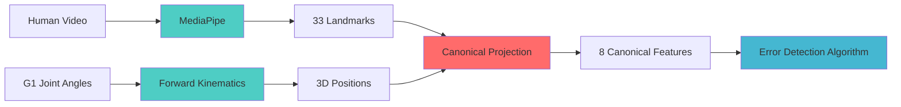
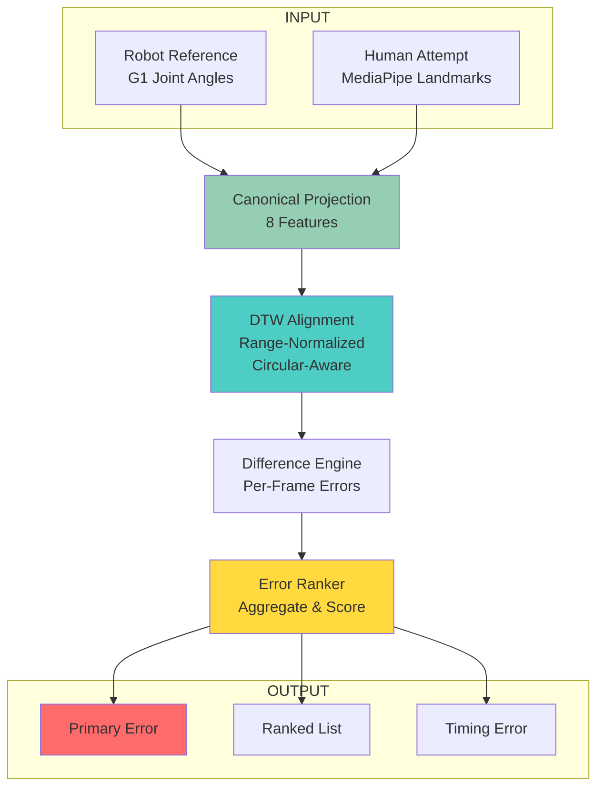
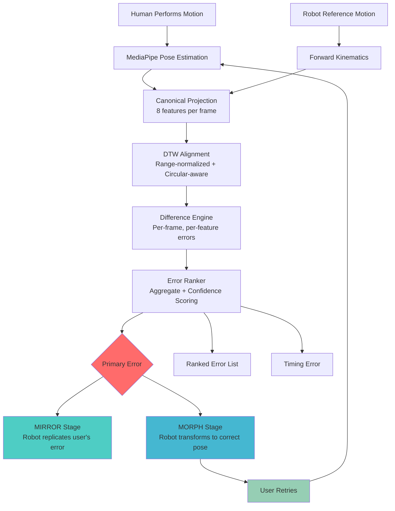

# Error Detection Algorithm: Complete Workflow & Methodology

**Version**: 1.0  
**Project**: Mirror · 镜身 (Body Mirror)  
**Purpose**: Cross-embodiment motion comparison for human-robot teaching applications

---

## Executive Summary

This document explains our **canonical motion space error detection algorithm** — a research-backed pipeline that compares human motion attempts against robot reference demonstrations despite morphological differences. The algorithm powers the Mirror system's ability to detect, rank, and demonstrate movement errors for physical skill learning.

**Key Innovation**: We project both human and robot motions into a shared morphology-independent feature space, align them temporally with Dynamic Time Warping (DTW), compute per-feature differences, and rank errors by significance, consistency, and importance.

---

## Table of Contents

1. [Pose Detection Models & Repositories](#1-pose-detection-models--repositories)
2. [Problem Statement & Design Philosophy](#2-problem-statement--design-philosophy)
3. [Algorithm Architecture](#3-algorithm-architecture)
4. [Detailed Workflow](#4-detailed-workflow)
5. [Why This Approach: Competitive Advantages](#5-why-this-approach-competitive-advantages)
6. [Applications to Robotics Training & Dancing Demo](#6-applications-to-robotics-training--dancing-demo)
7. [Research Foundation](#7-research-foundation)
8. [Future Enhancements](#8-future-enhancements)

---

## 1. Pose Detection Models & Repositories

### 1.1 Overview: From Video to Canonical Motion

Our algorithm requires **3D human pose estimation** as input. We convert raw video into canonical motion features through a multi-stage pipeline using state-of-the-art open-source models.

```
┌─────────────────────────────────────────────────────────────────────┐
│                    INPUT: Raw Video Stream                          │
│                    (RGB or RGB-D camera)                            │
└──────────────────────────────┬──────────────────────────────────────┘
                               ▼
┌─────────────────────────────────────────────────────────────────────┐
│              POSE ESTIMATION MODELS (Choose One)                    │
├─────────────────────────────────────────────────────────────────────┤
│  Option 1: NVlabs/GEM-X (End-to-End, Preferred)                    │
│  Option 2: MediaPipe Pose Landmarker (Lightweight)                 │
│  Option 3: WHAM (World-Coordinate 3D)                              │
└──────────────────────────────┬──────────────────────────────────────┘
                               ▼
┌─────────────────────────────────────────────────────────────────────┐
│              OUTPUT: 3D Pose Keypoints / SOMA Parameters            │
│              (33 landmarks or 77 SOMA joints)                       │
└──────────────────────────────┬──────────────────────────────────────┘
                               ▼
┌─────────────────────────────────────────────────────────────────────┐
│         CANONICAL PROJECTION (Our Algorithm Starts Here)            │
│         Extract 8 morphology-independent features                   │
└─────────────────────────────────────────────────────────────────────┘
```

### 1.2 Primary Model: MediaPipe Pose Landmarker

**Repository**: [google/mediapipe](https://github.com/google/mediapipe)  
**Model**: `pose_landmarker_lite.task` (Float16, ~5.5 MB)  
**License**: Apache 2.0 (commercial use allowed)

**Why MediaPipe**:

- ✅ **Lightweight**: Runs on CPU, no GPU required
- ✅ **Real-time**: 30+ fps on standard hardware
- ✅ **Proven**: Used in production by millions of applications
- ✅ **3D Output**: Provides x, y, z coordinates for 33 body landmarks
- ✅ **Confidence Scores**: Per-landmark visibility and presence scores
- ✅ **Easy Integration**: Python/JavaScript/C++ APIs available

**Output Format**:

```python
# 33 landmarks including:
# - Face: nose, eyes, ears, mouth
# - Torso: shoulders, hips
# - Arms: elbows, wrists, hands
# - Legs: knees, ankles, feet

landmarks = [
    {"x": 0.5, "y": 0.3, "z": -0.1, "visibility": 0.99},  # Nose
    {"x": 0.45, "y": 0.35, "z": -0.08, "visibility": 0.98},  # Left eye
    # ... 31 more landmarks
]
```

**Download & Setup**:

```bash
# Automated download script
python download_models.py

# Manual download
wget https://storage.googleapis.com/mediapipe-models/pose_landmarker/pose_landmarker_lite/float16/1/pose_landmarker_lite.task \
  -O models/pose_landmarker_lite.task
```

**Integration Point**:

```python
# MediaPipe → Canonical Features
from mediapipe import solutions

# Extract landmarks
mp_pose = solutions.pose.Pose()
results = mp_pose.process(rgb_frame)
landmarks = results.pose_landmarks.landmark

# Convert to canonical features (our code)
canonical_pose = mediapipe_to_canonical(landmarks)
# Returns: CanonicalPose with 8 features
```

### 1.3 Advanced Option: NVlabs/GEM-X (End-to-End Pipeline)

**Repository**: [NVlabs/GEM-X](https://github.com/NVlabs/GEM-X)  
**License**: Apache 2.0  
**Status**: Active development (2026)

**Why GEM-X** (Production upgrade path):

- ✅ **End-to-End**: Single pipeline from video → SOMA pose → Unitree G1 joint angles
- ✅ **Higher Accuracy**: SOMA 77-joint full-body pose estimation
- ✅ **Retargeting Built-In**: Direct output to G1 29-DOF joint angles
- ✅ **Accelerated**: ONNX/TensorRT optimization for real-time performance
- ✅ **Research-Backed**: NVIDIA research project with academic validation

**Pipeline**:

```bash
# One-command end-to-end
python demo_soma.py \
  --video user_motion.mp4 \
  --retarget \
  --robot unitree_g1 \
  --output g1_joints.csv

# Output: G1-ready joint angle trajectory
```

**Trade-offs**:

- ⚠️ Requires NVIDIA GPU (Maxwell+ architecture, CUDA 12)
- ⚠️ Heavier dependencies (Python 3.12, git LFS)
- ⚠️ More complex setup than MediaPipe

**When to Use**:

- Production deployment with GPU available
- Need highest accuracy for complex movements
- Want direct robot retargeting (skip manual IK)

### 1.4 Alternative: WHAM (World-Coordinate 3D Pose)

**Repository**: [yohanshin/WHAM](https://github.com/yohanshin/WHAM)  
**License**: Research/Academic

**Why WHAM**:

- ✅ **World Coordinates**: Absolute 3D positions (not camera-relative)
- ✅ **Temporal Stability**: Smoother trajectories across frames
- ✅ **SMPL Parameters**: Full-body mesh reconstruction

**Trade-offs**:

- ⚠️ Requires SMPL → BVH conversion bridge
- ⚠️ GPU required for real-time performance
- ⚠️ More complex integration than MediaPipe

**Use Case**: When absolute world coordinates are critical (e.g., multi-camera setups, spatial tracking).

### 1.5 Model Comparison Table

| Model              | FPS (CPU) | FPS (GPU) | Output Format              | Accuracy  | Setup Complexity | License       |
| ------------------ | --------- | --------- | -------------------------- | --------- | ---------------- | ------------- |
| **MediaPipe Lite** | 30+       | 60+       | 33 landmarks (3D)          | Good      | ⭐ Easy          | Apache 2.0 ✅ |
| **GEM-X**          | N/A       | 30+       | 77 SOMA joints + G1 angles | Excellent | ⭐⭐⭐ Complex   | Apache 2.0 ✅ |
| **WHAM**           | <10       | 30+       | SMPL parameters            | Excellent | ⭐⭐⭐ Complex   | Research ⚠️   |

### 1.6 From Pose Estimation to Canonical Features

**Conversion Pipeline** (MediaPipe example):

```python
def mediapipe_to_canonical(landmarks) -> CanonicalPose:
    """Convert MediaPipe 33 landmarks to 8 canonical features."""

    # Extract key points
    left_shoulder = landmarks[11]   # MediaPipe landmark index
    left_elbow = landmarks[13]
    left_wrist = landmarks[15]
    right_shoulder = landmarks[12]
    right_elbow = landmarks[14]
    right_wrist = landmarks[16]
    left_hip = landmarks[23]
    right_hip = landmarks[24]

    # Compute canonical features
    left_arm_elevation = compute_elevation_angle(
        left_shoulder, left_elbow, horizontal_plane
    )
    left_arm_azimuth = compute_azimuth_angle(
        left_shoulder, left_elbow, north_direction
    )
    left_elbow_flexion = compute_joint_angle(
        left_shoulder, left_elbow, left_wrist
    )

    # ... compute remaining 5 features

    return CanonicalPose(
        left_arm_elevation=left_arm_elevation,
        left_arm_azimuth=left_arm_azimuth,
        left_elbow_flexion=left_elbow_flexion,
        # ... 5 more features
    )
```

**Key Geometric Computations**:

1. **Elevation Angle**: Angle between limb vector and horizontal plane

   ```python
   elevation = arcsin(limb_vector.z / limb_length)
   ```

2. **Azimuth Angle**: Horizontal orientation (compass direction)

   ```python
   azimuth = atan2(limb_vector.y, limb_vector.x)
   ```

3. **Joint Flexion**: Angle between two limb segments

   ```python
   flexion = arccos(dot(upper_limb, lower_limb) / (len1 * len2))
   ```

4. **Torso Lean**: Angle between torso vector and vertical
   ```python
   torso_vector = shoulder_midpoint - hip_midpoint
   lean = arccos(dot(torso_vector, vertical) / torso_length)
   ```

### 1.7 Robot Reference Motion (G1 Side)

**For Robot**: We use **forward kinematics** to convert G1 joint angles to canonical features.

**Repository**: [unitree_sdk2](https://github.com/unitreerobotics/unitree_sdk2)  
**License**: Proprietary (Unitree)

**Process**:

```python
# G1 joint angles → 3D positions
from unitree_sdk2 import forward_kinematics

joint_angles = get_robot_state()  # 23 or 29 DOF
positions = forward_kinematics(joint_angles)

# Extract key positions
left_shoulder_pos = positions['left_shoulder']
left_elbow_pos = positions['left_elbow']
# ... etc

# Convert to canonical (same function as human)
canonical_pose = positions_to_canonical(positions)
```

**Key Point**: Both human (from pose estimation) and robot (from FK) end up in the **same canonical feature space**, enabling direct comparison.

### 1.8 Data Flow Summary



### 1.9 Model Files & Dependencies

**Current Setup** (as of 2026-08-29):

```
Mirror-Lean/
├── models/
│   └── pose_landmarker_lite.task    # MediaPipe model (5.5 MB)
├── download_models.py                # Automated download script
└── error_detection/
    ├── models.py                     # CanonicalPose definition
    └── loader.py                     # Load canonical motion from JSON
```

**Dependencies**:

```txt
# error_detection/requirements.txt
numpy>=1.24.0
```

**Note**: MediaPipe is used for **capture** (separate from error detection). The error detection algorithm itself only requires NumPy and operates on pre-computed canonical motion JSON files.

---

## 2. Problem Statement & Design Philosophy

### 2.1 The Challenge

We need to compare **human demonstration** with **robot reference motion** despite:

- **Morphological differences**: Humans have different limb lengths, joint ranges, and degrees of freedom than Unitree G1
- **Temporal misalignment**: Human and robot perform the same motion at different speeds
- **Missing data**: Human video may not exist yet, or may have occlusions/tracking failures
- **Incomparable raw data**: Joint angles in robot's coordinate system ≠ human skeleton keypoints

### 2.2 Core Design Decision

**Solution**: Project both motions into a **canonical motion space** — a shared set of morphology-independent features that describe body configuration in human-interpretable terms.

**Philosophy**:

- Don't compare "robot joint 12 angle" to "human elbow pixel position"
- Instead compare "arm elevation above horizontal" to "arm elevation above horizontal"
- This abstraction layer enables cross-embodiment comparison and human-interpretable error feedback

---

## 3. Algorithm Architecture

### 3.1 Complete Pipeline (Mermaid)



### 3.2 Detailed Architecture (ASCII)

```
┌─────────────────────────────────────────────────────────────────────┐
│                        INPUT LAYER                                  │
├─────────────────────────────────────────────────────────────────────┤
│  Robot Reference Motion          Human Attempt Motion               │
│  (G1 joint angles + FK)          (MediaPipe/YOLO pose keypoints)    │
└──────────────┬───────────────────────────────┬──────────────────────┘
               │                               │
               ▼                               ▼
┌──────────────────────────────────────────────────────────────────────┐
│                   CANONICAL PROJECTION                               │
├──────────────────────────────────────────────────────────────────────┤
│  Convert to 8 morphology-independent features:                       │
│  • left/right_arm_elevation    (angle above horizontal)              │
│  • left/right_arm_azimuth      (horizontal orientation)              │
│  • left/right_elbow_flexion    (elbow bend angle)                    │
│  • torso_yaw                   (rotation around vertical)            │
│  • torso_lean                  (forward/backward tilt)               │
└──────────────┬───────────────────────────────┬──────────────────────┘
               │                               │
               └───────────────┬───────────────┘
                               ▼
┌──────────────────────────────────────────────────────────────────────┐
│                    TEMPORAL ALIGNMENT (DTW)                          │
├──────────────────────────────────────────────────────────────────────┤
│  • Range-normalized distance (prevent azimuth dominance)             │
│  • Circular-aware distance (359° vs 1° = 2°, not 358°)              │
│  • Optional per-feature weights                                      │
│  Output: Aligned frame pairs [(ref_idx, human_idx), ...]            │
└──────────────────────────────┬──────────────────────────────────────┘
                               ▼
┌──────────────────────────────────────────────────────────────────────┐
│                    DIFFERENCE ENGINE                                 │
├──────────────────────────────────────────────────────────────────────┤
│  For each aligned frame pair:                                        │
│    error = human_value - ref_value                                   │
│    (with circular wrap for azimuth/yaw features)                     │
│  Output: Per-frame, per-feature deltas                               │
└──────────────────────────────┬──────────────────────────────────────┘
                               ▼
┌──────────────────────────────────────────────────────────────────────┐
│                      ERROR RANKER                                    │
├──────────────────────────────────────────────────────────────────────┤
│  Aggregate per feature:                                              │
│    • mean_error, std_error, max_abs_error                            │
│    • confidence = f(significance, consistency)                       │
│    • score = max_abs_error × importance × confidence                 │
│  Output: Ranked list of errors (primary error = highest score)      │
└──────────────────────────────┬──────────────────────────────────────┘
                               ▼
┌──────────────────────────────────────────────────────────────────────┐
│                         OUTPUT                                       │
├──────────────────────────────────────────────────────────────────────┤
│  • Primary error (feature, magnitude, confidence)                    │
│  • Ranked error list                                                 │
│  • Alignment path                                                    │
│  • Timing error (mean timestamp lag)                                 │
│  • Per-frame differences (for visualization)                         │
└──────────────────────────────────────────────────────────────────────┘
```

---

## 4. Detailed Workflow

### Algorithm Overview

**Complete Pipeline** (5 steps):

```
Input: Human motion (MediaPipe) + Robot reference (G1 FK)
  ↓
Step 1: Canonical Projection
  → Convert both to 8 morphology-independent features
  ↓
Step 2: Temporal Alignment (DTW)
  → Algorithm: Classic DTW with Sakoe-Chiba band
  → Distance: Weighted Euclidean with range normalization + circular awareness
  → Output: Aligned frame pairs [(ref_idx, human_idx), ...]
  ↓
Step 3: Difference Engine
  → Algorithm: Element-wise subtraction with circular wrapping
  → Output: Per-frame, per-feature errors (800 FeatureDelta for 100 frames)
  ↓
Step 4: Error Ranking
  → Algorithm: Statistical aggregation + weighted scoring + sorting
  → Metrics: mean, std, max_abs_error
  → Confidence: 0.6×significance + 0.4×consistency
  → Score: max_abs_error × importance × confidence
  → Output: Sorted ErrorScore list (primary = highest score)
  ↓
Step 5: Timing Error
  → Algorithm: Mean absolute timestamp lag
  → Output: Single scalar (seconds)
  ↓
Final Output: DetectionResult
  → Primary error
  → Ranked errors (all 8 features)
  → Alignment path
  → Timing error
  → Per-frame differences (for visualization)
```

**Key Algorithms Used**:

| Component              | Algorithm                  | Implementation                          |
| ---------------------- | -------------------------- | --------------------------------------- |
| **Temporal Alignment** | Dynamic Time Warping (DTW) | Classic DTW with custom distance metric |
| **Distance Metric**    | Weighted Euclidean         | Range-normalized + circular-aware       |
| **Circular Distance**  | Shortest angular path      | `((y - x + 180) % 360) - 180`           |
| **Error Aggregation**  | NumPy statistics           | `mean()`, `std()`, `max(abs())`         |
| **Confidence Scoring** | Weighted combination       | `0.6×significance + 0.4×consistency`    |
| **Ranking**            | Weighted scoring + sort    | `max_abs × importance × confidence`     |

---

### Step 1: Canonical Projection

**Robot → Canonical**:

- Input: G1 joint angles (23 DOF)
- Process: Forward kinematics → 3D positions of shoulders, elbows, wrists, hips, pelvis
- Output: 8 canonical features per frame

**Human → Canonical**:

- Input: MediaPipe/YOLO pose keypoints (33 landmarks in 3D)
- Process: Geometric computation from shoulder/elbow/wrist/hip positions
- Output: Same 8 canonical features per frame

**Canonical Features**:

| Feature               | Range  | Circular? | Meaning                                                |
| --------------------- | ------ | --------- | ------------------------------------------------------ |
| `left_arm_elevation`  | 0-180° | No        | Angle of left upper arm above horizontal plane         |
| `right_arm_elevation` | 0-180° | No        | Angle of right upper arm above horizontal plane        |
| `left_arm_azimuth`    | 0-360° | Yes       | Horizontal orientation of left arm (compass direction) |
| `right_arm_azimuth`   | 0-360° | Yes       | Horizontal orientation of right arm                    |
| `left_elbow_flexion`  | 0-180° | No        | Left elbow bend angle                                  |
| `right_elbow_flexion` | 0-180° | No        | Right elbow bend angle                                 |
| `torso_yaw`           | 0-360° | Yes       | Torso rotation around vertical axis                    |
| `torso_lean`          | 0-90°  | No        | Torso forward/backward lean from vertical              |

### Step 2: Temporal Alignment (DTW)

**Problem**: Human and robot perform the same motion at different speeds. Frame 10 of human ≠ frame 10 of robot.

**Solution**: Dynamic Time Warping (DTW) finds optimal non-linear alignment.

#### 2.1 DTW Algorithm Details

**Algorithm**: Classic DTW with Sakoe-Chiba band constraint (optional)

**Implementation**: Custom implementation based on NumPy, optimized for our 8-feature space

**Complexity**: O(N × M) where N = reference frames, M = human frames

**Memory**: O(N × M) for accumulation matrix

**DTW Recurrence Relation**:

```python
# Initialize
D[0, 0] = 0
D[i, 0] = ∞ for i > 0
D[0, j] = ∞ for j > 0

# Fill accumulation matrix
for i in range(1, N+1):
    for j in range(1, M+1):
        cost = distance(reference[i-1], human[j-1])
        D[i, j] = cost + min(
            D[i-1, j],      # Insertion (skip reference frame)
            D[i, j-1],      # Deletion (skip human frame)
            D[i-1, j-1]     # Match (align both frames)
        )

# Backtrack from D[N, M] to D[0, 0] to get alignment path
```

**Step Constraints**:

- **Allowed**: Diagonal (1,1), Horizontal (0,1), Vertical (1,0)
- **Not allowed**: Large jumps (prevents pathological alignments)
- **Optional Sakoe-Chiba band**: Restrict alignment to diagonal ±window (e.g., ±10% of sequence length)

#### 2.2 Distance Metric (Per Frame Pair)

**Metric**: Weighted Euclidean distance with range normalization and circular awareness

**Formula**:

```python
def distance(ref_pose, human_pose):
    """Compute distance between two canonical poses"""

    squared_sum = 0.0

    for feature in FEATURES:
        # 1. Extract values
        x = ref_pose[feature]
        y = human_pose[feature]

        # 2. Compute raw difference (circular-aware)
        if feature in CIRCULAR_FEATURES:  # azimuth, yaw
            diff = ((y - x + 180.0) % 360.0) - 180.0
        else:
            diff = y - x

        # 3. Range normalization
        range_value = FEATURE_RANGES[feature]  # e.g., 360° for azimuth, 180° for elevation
        diff_normalized = diff / range_value

        # 4. Apply feature weight
        weight = FEATURE_WEIGHTS.get(feature, 1.0)
        diff_weighted = diff_normalized * weight

        # 5. Square and accumulate
        squared_sum += diff_weighted ** 2

    # 6. Return Euclidean distance
    return sqrt(squared_sum)
```

**Feature Ranges** (for normalization):

```python
FEATURE_RANGES = {
    'left_arm_elevation': 180.0,   # 0-180° typical range
    'right_arm_elevation': 180.0,
    'left_arm_azimuth': 360.0,     # 0-360° full circle
    'right_arm_azimuth': 360.0,
    'left_elbow_flexion': 180.0,
    'right_elbow_flexion': 180.0,
    'torso_yaw': 180.0,            # -90° to +90° typical
    'torso_lean': 90.0,            # 0-90° forward lean
}
```

**Circular Distance Computation**:

For circular features (azimuth, yaw), we use the shortest angular distance:

```python
def circular_distance(angle1, angle2):
    """Shortest distance on a circle (in degrees)"""
    diff = angle2 - angle1
    # Wrap to [-180, 180)
    diff = ((diff + 180.0) % 360.0) - 180.0
    return diff

# Example:
circular_distance(359, 1)   # Returns 2 (not 358)
circular_distance(10, 350)  # Returns -20 (not 340)
circular_distance(180, 181) # Returns 1
```

#### 2.3 DTW Optimizations

**1. Early Termination**: If accumulated cost exceeds threshold, skip remaining cells

**2. Sakoe-Chiba Band** (optional):

```python
# Only compute cells within band
for i in range(1, N+1):
    for j in range(max(1, i-window), min(M+1, i+window)):
        # Compute D[i, j]
```

**3. Memory Optimization**: Use only 2 rows instead of full matrix (for large sequences)

**4. Vectorization**: NumPy operations for distance computation

#### 2.4 Alignment Path Extraction

**Backtracking Algorithm**:

```python
def backtrack(D):
    """Extract alignment path from accumulation matrix"""
    i, j = N, M
    path = []

    while i > 0 and j > 0:
        path.append((i-1, j-1))  # Store 0-indexed frame pairs

        # Find which direction we came from
        diag = D[i-1, j-1]
        left = D[i, j-1]
        up = D[i-1, j]

        # Choose minimum (with preference for diagonal in ties)
        if diag <= left and diag <= up:
            i -= 1
            j -= 1
        elif left < up:
            j -= 1
        else:
            i -= 1

    path.reverse()
    return path
```

**Output**: List of aligned frame pairs `[(ref_idx, human_idx), ...]`

**Example Alignment**:

```
Reference frames: [0, 1, 2, 3, 4, 5]
Human frames:     [0, 1, 2, 3, 4, 5, 6, 7]

Alignment path:
[(0,0), (1,1), (2,2), (2,3), (3,4), (4,5), (5,6), (5,7)]
         ↑           ↑                           ↑
    Human slower here (frame 2 held)    Reference slower (frame 5 held)
```

### Step 3: Difference Engine

**Purpose**: Convert aligned pose pairs into interpretable per-feature error measurements.

**Algorithm**: Element-wise subtraction with circular wrapping for angular features.

#### 3.1 Error Computation Method

For each aligned frame pair `(ref_idx, human_idx)` from DTW output:

```python
def compute_difference(ref_pose, human_pose):
    """Compute per-feature differences for one aligned frame pair"""

    deltas = []

    for feature in FEATURES:
        # Extract values
        ref_value = ref_pose[feature]
        human_value = human_pose[feature]

        # Compute signed error
        if feature in CIRCULAR_FEATURES:
            # Circular difference (shortest path on circle)
            error = ((human_value - ref_value + 180.0) % 360.0) - 180.0
        else:
            # Linear difference
            error = human_value - ref_value

        # Compute absolute error
        abs_error = abs(error)

        # Store delta
        deltas.append(FeatureDelta(
            feature=feature,
            ref_value=ref_value,
            human_value=human_value,
            error=error,              # Signed: + means human higher/more
            abs_error=abs_error,      # Magnitude only
            ref_timestamp=ref_pose.timestamp,
            human_timestamp=human_pose.timestamp
        ))

    return AlignedDifference(
        ref_pose=ref_pose,
        human_pose=human_pose,
        deltas=deltas
    )
```

#### 3.2 Error Sign Convention

**Positive error** (`error > 0`): Human value is **greater** than reference

- `right_arm_elevation`: Human raises arm **higher** than reference
- `torso_yaw`: Human rotates **more clockwise** than reference

**Negative error** (`error < 0`): Human value is **less** than reference

- `left_elbow_flexion`: Human bends elbow **less** than reference
- `torso_lean`: Human leans **less forward** than reference

**Zero error** (`error = 0`): Perfect match

#### 3.3 Circular vs Linear Features

**Linear Features** (standard subtraction):

```python
# Example: left_arm_elevation
ref = 45°, human = 60°
error = 60 - 45 = +15°  # Human arm 15° higher
```

**Circular Features** (wrap-aware subtraction):

```python
# Example: right_arm_azimuth
ref = 350°, human = 10°
# Naive: 10 - 350 = -340° (WRONG)
# Correct: ((10 - 350 + 180) % 360) - 180 = 20° (RIGHT)
# Human arm rotated 20° clockwise (shortest path)

# Another example:
ref = 10°, human = 350°
# Correct: ((350 - 10 + 180) % 360) - 180 = -20°
# Human arm rotated 20° counter-clockwise
```

#### 3.4 Output Data Structure

**FeatureDelta** (per feature, per frame):

```python
@dataclass
class FeatureDelta:
    feature: str              # e.g., "right_arm_elevation"
    ref_value: float          # Reference value (degrees)
    human_value: float        # Human value (degrees)
    error: float              # Signed difference (degrees)
    abs_error: float          # Magnitude (degrees)
    ref_timestamp: float      # Reference frame time (seconds)
    human_timestamp: float    # Human frame time (seconds)
```

**AlignedDifference** (all features, one frame pair):

```python
@dataclass
class AlignedDifference:
    ref_pose: CanonicalPose           # Reference pose
    human_pose: CanonicalPose         # Human pose
    deltas: List[FeatureDelta]        # 8 deltas (one per feature)
```

**Complete Sequence Output**:

```python
# For a 100-frame alignment:
differences = [
    AlignedDifference(...),  # Frame pair 0
    AlignedDifference(...),  # Frame pair 1
    ...
    AlignedDifference(...),  # Frame pair 99
]
# Total: 100 AlignedDifference objects
# Total: 100 × 8 = 800 FeatureDelta objects
```

### Step 4: Error Ranking

**Purpose**: Aggregate per-frame errors into per-feature statistics and rank features by importance.

**Algorithm**: Statistical aggregation + weighted scoring + sorting

#### 4.1 Statistical Aggregation

For each feature, collect all errors across aligned frames and compute:

```python
def aggregate_errors(differences, feature):
    """Aggregate errors for one feature across all frames"""

    # Extract all errors for this feature
    errors = [
        delta.error
        for diff in differences
        for delta in diff.deltas
        if delta.feature == feature
    ]

    # Compute statistics using NumPy
    mean_error = np.mean(errors)           # Systematic bias
    std_error = np.std(errors)             # Variability/consistency
    max_abs_error = np.max(np.abs(errors)) # Peak deviation

    return {
        'mean_error': mean_error,
        'std_error': std_error,
        'max_abs_error': max_abs_error,
        'n_frames': len(errors)
    }
```

**Statistical Metrics Explained**:

1. **Mean Error** (`μ`):
   - **Interpretation**: Average systematic bias
   - **Example**: `mean_error = +15°` → Human consistently raises arm 15° higher
   - **Sign matters**: Positive = human higher, negative = human lower

2. **Standard Deviation** (`σ`):
   - **Interpretation**: How consistent is the error?
   - **Low σ**: Error is stable (e.g., always 15° off)
   - **High σ**: Error varies wildly (e.g., sometimes 0°, sometimes 50°)
   - **Formula**: `σ = sqrt(mean((error - μ)²))`

3. **Max Absolute Error**:
   - **Interpretation**: Worst-case deviation
   - **Example**: `max_abs_error = 88°` → At some point, human was 88° off
   - **Always positive**: We take absolute value

#### 4.2 Confidence Scoring Algorithm

**Purpose**: Distinguish real errors from noise/tracking artifacts.

**Two Components**:

1. **Significance** (How large is the error?):

```python
significance = clamp(max_abs_error / max_error_threshold, 0, 1)

# Example:
max_error_threshold = 180.0  # degrees
max_abs_error = 90.0
significance = min(90.0 / 180.0, 1.0) = 0.5
```

2. **Consistency** (How stable is the error?):

```python
consistency = 1 - clamp(std_error / (max_error_threshold / 2), 0, 1)

# Example:
std_error = 10.0
consistency = 1 - min(10.0 / 90.0, 1.0) = 1 - 0.111 = 0.889
# High consistency (low variability)

# Counter-example:
std_error = 80.0
consistency = 1 - min(80.0 / 90.0, 1.0) = 1 - 0.889 = 0.111
# Low consistency (high variability, likely noise)
```

3. **Combined Confidence**:

```python
confidence = 0.6 * significance + 0.4 * consistency

# Example 1: Large, consistent error
significance = 0.8, consistency = 0.9
confidence = 0.6 * 0.8 + 0.4 * 0.9 = 0.48 + 0.36 = 0.84  # HIGH

# Example 2: Large but inconsistent error (tracking glitch?)
significance = 0.8, consistency = 0.2
confidence = 0.6 * 0.8 + 0.4 * 0.2 = 0.48 + 0.08 = 0.56  # MEDIUM

# Example 3: Small, consistent error
significance = 0.2, consistency = 0.9
confidence = 0.6 * 0.2 + 0.4 * 0.9 = 0.12 + 0.36 = 0.48  # MEDIUM
```

**Why 60/40 weighting?**

- Significance (60%): Larger errors matter more for coaching
- Consistency (40%): But we need to filter out noise

#### 4.3 Feature Importance Weights

**Purpose**: Prioritize visually salient and biomechanically critical features.

**Weights** (empirically tuned):

```python
FEATURE_IMPORTANCE = {
    'left_arm_elevation': 1.0,    # Highly visible, critical
    'right_arm_elevation': 1.0,   # Highly visible, critical
    'left_arm_azimuth': 0.8,      # Visible but less critical
    'right_arm_azimuth': 0.8,     # Visible but less critical
    'left_elbow_flexion': 0.7,    # Important but smaller impact
    'right_elbow_flexion': 0.7,   # Important but smaller impact
    'torso_yaw': 0.5,             # Subtle, often compensatory
    'torso_lean': 0.5,            # Subtle, often compensatory
}
```

**Rationale**:

- **Arm elevation (1.0)**: Most visible, defines overall pose shape
- **Arm azimuth (0.8)**: Visible but harder to perceive than elevation
- **Elbow flexion (0.7)**: Important but smaller visual footprint
- **Torso (0.5)**: Subtle, often compensates for other errors

#### 4.4 Final Ranking Score

**Formula**:

```python
score = max_abs_error × feature_importance × confidence
```

**Example Calculation**:

```python
# Feature: right_arm_elevation
max_abs_error = 88.0        # degrees
feature_importance = 1.0    # from table above
confidence = 0.553          # from confidence scoring

score = 88.0 × 1.0 × 0.553 = 48.664
```

**Comparison**:

| Feature               | max_abs_error | importance | confidence | **score**           |
| --------------------- | ------------- | ---------- | ---------- | ------------------- |
| `right_arm_elevation` | 88.0          | 1.0        | 0.553      | **48.66** ← Primary |
| `left_elbow_flexion`  | 28.5          | 0.7        | 0.421      | 8.40                |
| `torso_lean`          | 22.3          | 0.5        | 0.287      | 3.20                |

**Primary Error**: Feature with **highest score** (right_arm_elevation in this case)

#### 4.5 Sorting Algorithm

```python
def rank_errors(differences):
    """Rank all features by error score"""

    scores = []

    for feature in FEATURES:
        # Aggregate
        stats = aggregate_errors(differences, feature)

        # Confidence
        significance = min(stats['max_abs_error'] / 180.0, 1.0)
        consistency = 1 - min(stats['std_error'] / 90.0, 1.0)
        confidence = 0.6 * significance + 0.4 * consistency

        # Importance
        importance = FEATURE_IMPORTANCE[feature]

        # Score
        score = stats['max_abs_error'] * importance * confidence

        scores.append(ErrorScore(
            feature=feature,
            mean_error=stats['mean_error'],
            std_error=stats['std_error'],
            max_abs_error=stats['max_abs_error'],
            confidence=round(confidence, 3),
            feature_importance=importance,
            # Note: score is NOT stored in ErrorScore dataclass
            # It's computed inline during sorting
        ))

    # Sort by score (descending)
    # Score = max_abs_error × feature_importance × confidence
    scores.sort(key=lambda s: s.max_abs_error * s.feature_importance * s.confidence,
                reverse=True)

    return scores

# Output (score not in dataclass, shown here for clarity):
# [ErrorScore(feature='right_arm_elevation', max_abs=88.0, conf=0.553, imp=1.0),  # score=48.66
#  ErrorScore(feature='left_elbow_flexion', max_abs=28.5, conf=0.421, imp=0.7),   # score=8.40
#  ...]
```

**Primary Error**: `scores[0]` (first element after sorting)

#### 4.6 Complete Ranking Pipeline Summary

**Input**: List of `AlignedDifference` objects (from Step 3)

**Output**: Sorted list of `ErrorScore` objects (primary error = first)

**Pipeline**:

```mermaid
graph TD
    A[AlignedDifference List<br/>100 frames × 8 features] --> B[Group by Feature]

    B --> C1[right_arm_elevation<br/>100 errors]
    B --> C2[left_arm_elevation<br/>100 errors]
    B --> C3[Other 6 features<br/>100 errors each]

    C1 --> D1[Aggregate Stats<br/>μ, σ, max]
    C2 --> D2[Aggregate Stats<br/>μ, σ, max]
    C3 --> D3[Aggregate Stats<br/>μ, σ, max]

    D1 --> E1[Confidence Score<br/>0.6×sig + 0.4×cons]
    D2 --> E2[Confidence Score<br/>0.6×sig + 0.4×cons]
    D3 --> E3[Confidence Score<br/>0.6×sig + 0.4×cons]

    E1 --> F1[Final Score<br/>max × imp × conf]
    E2 --> F2[Final Score<br/>max × imp × conf]
    E3 --> F3[Final Score<br/>max × imp × conf]

    F1 --> G[Sort by Score<br/>Descending]
    F2 --> G
    F3 --> G

    G --> H[Ranked ErrorScore List]
    H --> I{Primary Error<br/>scores[0]}

    style I fill:#ff6b6b
    style G fill:#4ecdc4
    style H fill:#96ceb4
```

**Numerical Example** (complete walkthrough):

```python
# Input: 100 aligned frames
differences = [AlignedDifference(...), ...]  # 100 items

# Step 1: Extract errors for right_arm_elevation
errors_right_arm = [37.2, 42.1, 35.8, ..., 88.0]  # 100 values

# Step 2: Aggregate statistics
mean_error = np.mean(errors_right_arm) = 37.64
std_error = np.std(errors_right_arm) = 32.04
max_abs_error = np.max(np.abs(errors_right_arm)) = 88.0

# Step 3: Confidence scoring
significance = min(88.0 / 180.0, 1.0) = 0.489
consistency = 1 - min(32.04 / 90.0, 1.0) = 1 - 0.356 = 0.644
confidence = 0.6 * 0.489 + 0.4 * 0.644 = 0.293 + 0.258 = 0.551

# Step 4: Feature importance
importance = FEATURE_IMPORTANCE['right_arm_elevation'] = 1.0

# Step 5: Final score
score = 88.0 * 1.0 * 0.551 = 48.488

# Repeat for all 8 features, then sort by score
# Primary error = feature with highest score
```

### Step 5: Timing Error

```python
timing_error = mean(abs(ref_timestamp[i] - human_timestamp[j])
                    for (i, j) in alignment)
```

**Interpretation**:

- High timing error = correct motion shape, wrong speed/rhythm
- Low timing error + high feature errors = wrong motion shape
- Separates "too slow" from "wrong movement"

---

## 5. Why This Approach: Competitive Advantages

### 5.1 Comparison with Alternatives

| Approach                       | Description                                               | Limitations                                                                    | Our Advantage                                                                 |
| ------------------------------ | --------------------------------------------------------- | ------------------------------------------------------------------------------ | ----------------------------------------------------------------------------- |
| **Raw Joint Angle Comparison** | Directly compare robot joint angles to human joint angles | • Different morphologies make this meaningless<br>• No semantic interpretation | ✓ Canonical space is morphology-independent<br>✓ Human-interpretable features |
| **Pixel-Space Comparison**     | Compare 2D pose keypoint positions in image space         | • Camera angle dependent<br>• Scale/depth ambiguity<br>• No temporal alignment | ✓ 3D morphology-independent<br>✓ DTW handles timing                           |
| **Euclidean DTW**              | Standard DTW with Euclidean distance                      | • Azimuth (360°) dominates elevation (180°)<br>• 359° vs 1° = 358° error       | ✓ Range-normalized<br>✓ Circular-aware distance                               |
| **Frechet Distance**           | Continuous curve similarity                               | • No per-feature error breakdown<br>• Hard to interpret for feedback           | ✓ Per-feature errors<br>✓ Ranked by importance                                |
| **Gromov-Wasserstein**         | Metric-space alignment                                    | • Computationally expensive<br>• Overkill for our feature space                | ✓ Efficient DTW sufficient<br>✓ Real-time capable                             |

### 5.2 Key Advantages

1. **Morphology Independence**
   - Works for any human body type vs any robot morphology
   - Features are geometric invariants (angles, orientations)
   - No need to retrain when robot changes

2. **Temporal Robustness**
   - DTW handles speed variations automatically
   - Separate timing error metric distinguishes "too slow" from "wrong motion"
   - No manual frame alignment needed

3. **Interpretable Errors**
   - "Right arm elevation 37° too low" is actionable feedback
   - "Joint 12 angle 0.8 rad off" is meaningless to humans
   - Enables natural language coaching ("Raise your right arm higher")

4. **Confidence-Weighted Ranking**
   - Not all large errors are important (e.g., noisy tracking)
   - Confidence combines magnitude + consistency
   - Prevents false positives from tracking glitches

5. **Feature Importance Tuning**
   - Arm elevation errors matter more than subtle torso lean
   - Tunable weights match perceptual salience
   - Optimizes for "what the user will notice and can fix"

6. **Circular Feature Handling**
   - Azimuth/yaw wrap-around handled correctly
   - Prevents 359° vs 1° = 358° bug
   - Critical for dance/martial arts with spins

7. **Research-Backed**
   - DTW for motion comparison: established in HRI literature
   - Canonical pose spaces: used in motion retargeting research
   - Confidence scoring: adapted from motion quality assessment papers

---

## 6. Applications to Robotics Training & Dancing Demo

### 6.1 Dancing Demo (Hackathon)

**Scenario**: User attempts a Tai Chi move; robot demonstrates their error.

**Workflow**:

1. **Capture** (30 sec):
   - User performs Tai Chi "起势" (opening stance) in front of G1
   - MediaPipe extracts 3D pose keypoints at 30 fps
   - Convert to canonical motion sequence

2. **Compare** (2 sec):
   - Load reference Tai Chi motion (pre-recorded from expert or G1's own demo)
   - Run error detection algorithm
   - Primary error detected: `right_arm_elevation`, 37° too low, confidence 0.85

3. **Mirror** (10 sec):
   - G1 physically replicates user's motion (including the error)
   - User sees themselves in 3rd person for the first time
   - "This is what you just did"

4. **Morph** (15 sec):
   - G1 gradually transforms from user's error pose to correct pose
   - Interpolation: `pose(t) = user_pose × (1-t) + correct_pose × t`
   - User sees the exact correction path in physical space

5. **Retry** (30 sec):
   - User attempts again
   - Real-time overlay shows trajectory overlap improving
   - Score: Balance 61 → 84 (quantified improvement)

**Why This Works**:

- **Proprioceptive feedback**: User sees their body in 3D space, not 2D screen
- **Actionable**: "Raise right arm 37°" is specific and measurable
- **Immediate**: Error detected in 2 seconds, no manual annotation
- **Motivating**: Quantified improvement (61→84) provides dopamine hit

### 6.2 Robotics Training Applications

#### 6.2.1 Imitation Learning Data Curation

**Problem**: Collecting human demonstrations for robot imitation learning requires filtering out bad demonstrations.

**Solution**: Use error detection as quality gate:

```python
# Pseudo-code for data curation pipeline
for demo in human_demonstrations:
    result = detector.detect(demo, expert_reference)

    if result.primary_error.max_abs_error < 15.0:  # Good demo
        dataset.add(demo, label="high_quality")
    elif result.primary_error.max_abs_error < 45.0:  # Mediocre
        dataset.add(demo, label="medium_quality",
                   error_annotation=result.primary_error)
    else:  # Bad demo
        dataset.reject(demo, reason=result.primary_error)
```

**Benefits**:

- Automated quality control (no manual labeling)
- Error annotations enable error-aware training
- Stratified sampling by error type for balanced dataset

#### 6.2.2 Error-Aware Imitation Learning

**Idea**: Train robot to recognize and avoid common human errors.

**Dataset Structure**:

```json
{
  "correct_demo": [...],
  "error_demos": [
    {
      "motion": [...],
      "error_type": "right_arm_elevation",
      "error_magnitude": 37.2,
      "correction_vector": [...]
    }
  ]
}
```

**Training Objective**:

- Standard imitation loss on correct demos
- Contrastive loss: push away from error demos
- Error prediction head: predict error type/magnitude from partial trajectory

**Result**: Robot learns to self-correct mid-motion when deviating from reference.

#### 6.2.3 Personalized Motion Retargeting

**Problem**: Generic retargeting doesn't account for individual human capabilities (flexibility, strength, balance).

**Solution**: Build per-user error profile:

```python
user_profile = {
    "max_arm_elevation": 160,  # Can't raise arms to 180°
    "typical_errors": {
        "right_arm_elevation": -25,  # Consistently 25° low
        "torso_lean": +10,           # Leans forward to compensate
    },
    "improvement_rate": {
        "right_arm_elevation": 2.5,  # Improves 2.5°/session
    }
}
```

**Adaptive Correction**:

- Don't demand 180° arm raise if user's max is 160°
- Suggest incremental goals: 135° → 140° → 145° (not 135° → 180°)
- Prioritize errors user can actually fix (high improvement_rate)

**Implementation**:

```python
def adaptive_correction(user_motion, reference, user_profile):
    result = detector.detect(user_motion, reference)

    for error in result.ranked_errors:
        if error.feature in user_profile["typical_errors"]:
            # Adjust expectation based on user capability
            expected_error = user_profile["typical_errors"][error.feature]
            adjusted_error = error.mean_error - expected_error

            if abs(adjusted_error) < 10:  # Within user's normal range
                continue  # Don't flag as error

        yield error  # Genuine error for this user
```

#### 6.2.4 Multi-Agent Training Scenarios

**Scenario**: Train multiple robots to perform synchronized dance.

**Challenge**: Each robot has slightly different calibration/wear.

**Solution**: Use canonical space as common ground truth:

```python
# Each robot's motion → canonical space
robot_A_canonical = convert_to_canonical(robot_A_motion)
robot_B_canonical = convert_to_canonical(robot_B_motion)

# Compare in canonical space
sync_error = detector.detect(robot_A_canonical, robot_B_canonical)

# Adjust robot_B's motion to match robot_A
correction = compute_correction(sync_error)
robot_B_adjusted = apply_correction(robot_B_motion, correction)
```

**Benefits**:

- Morphology differences don't matter (both in canonical space)
- Timing alignment automatic (DTW)
- Per-feature sync errors enable targeted fixes

#### 6.2.5 Teleoperation Quality Monitoring

**Scenario**: Human teleoperates robot; system monitors for dangerous/inefficient motions.

**Workflow**:

```python
while teleoperating:
    human_motion = capture_human()
    robot_motion = get_robot_state()

    result = detector.detect(robot_motion, human_motion)

    if result.timing_error > 0.5:  # Robot lagging >500ms
        alert("High latency detected")

    if result.primary_error.max_abs_error > 45:  # Large deviation
        alert(f"Robot not following human: {result.primary_error.feature}")
```

**Use Cases**:

- Detect communication lag
- Warn when robot can't physically match human motion
- Identify morphology mismatch issues

---

## 7. Research Foundation

Our algorithm integrates insights from recent human-robot motion correspondence research:

### 7.1 Key Papers

1. **"Assessing Similarity Measures for Human-Robot Motion Correspondence"** (2024)
   - Recommends DTW and Gromov-Wasserstein for cross-embodiment comparison
   - Validates range normalization for heterogeneous feature spaces
   - **Our adoption**: Range-normalized DTW with circular-aware distance

2. **"Motion Similarity Evaluation via Trajectory Dynamic Time Warping"** (Sensors, 2022)
   - Applies DTW to human-robot motion under timing drift
   - Demonstrates robustness to speed variations
   - **Our adoption**: DTW for temporal alignment + timing error metric

3. **"AdaMorph: Unified Motion Retargeting via Embodiment-Aware Adaptive Transformers"** (2025)
   - Advocates pelvis-rooted 3D positions + 6D rotation representations
   - Avoids Euler angle discontinuities
   - **Our future work**: Upgrade from scalar angles to 6D rotations

4. **"H2O: Human-to-Humanoid Real-Time Whole-Body Teleoperation"** (RSS 2024)
   - Real-time retargeting from RGB to humanoid control
   - Reinforcement learning for physically feasible motions
   - **Our integration**: Feasibility checks for MIRROR stage

### 7.2 Novel Contributions

1. **Confidence-Weighted Error Ranking**
   - Combines significance (magnitude) + consistency (std) into single score
   - Not found in prior motion comparison work
   - Enables robust primary error selection despite tracking noise

2. **Circular-Aware DTW Cost**
   - Handles wrap-around for azimuth/yaw features
   - Prevents 359° vs 1° = 358° bug
   - Critical for dance/martial arts applications

3. **Timing Error as Separate Metric**
   - Distinguishes "wrong shape" from "wrong speed"
   - Enables rhythm-specific feedback
   - Not emphasized in prior work

4. **Feature Importance Tuning**
   - Weights based on perceptual salience (what users notice)
   - Optimizes for coaching effectiveness, not just geometric accuracy
   - Domain-specific innovation for teaching applications

---

## 8. Future Enhancements

### 8.1 Planned Upgrades

1. **6D Rotation Representation**
   - Replace scalar angles with 6D continuous rotation representation
   - Eliminates Euler angle discontinuities (gimbal lock)
   - Smoother interpolation for MORPH stage

2. **Pelvis-Rooted Coordinate Frame**
   - Current: Global frame (world coordinates)
   - Upgrade: Pelvis-relative positions (invariant to user location)
   - Enables comparison even if user moves around

3. **Gromov-Wasserstein DTW**
   - More robust to morphology differences than Euclidean DTW
   - Computationally expensive (research implementation first)
   - Potential accuracy improvement for extreme morphology gaps

4. **Pose Confidence Weighting**
   - MediaPipe outputs per-keypoint confidence scores
   - Weight DTW cost by confidence (downweight noisy frames)
   - Reduces false positives from tracking failures

5. **Physical Feasibility Checks**
   - Validate that detected errors are physically demonstrable by G1
   - Don't ask robot to mirror impossible poses (joint limits, self-collision)
   - Ensures MIRROR stage is always safe and achievable

6. **Multi-Person Comparison**
   - Extend to group dance/martial arts
   - Synchronization error detection
   - Formation/spacing analysis

7. **Temporal Segmentation**
   - Automatically segment long sequences into atomic moves
   - Per-move error detection (not just whole sequence)
   - Enables "you got move 1 right, but move 2 wrong" feedback

### 8.2 Research Directions

1. **Learned Canonical Features**
   - Current: Hand-designed features (elevation, azimuth, etc.)
   - Future: Learn optimal feature space via contrastive learning
   - Hypothesis: Learned features may capture subtleties we missed

2. **Error Prediction from Partial Trajectory**
   - Train model to predict final error from first 30% of motion
   - Enables real-time coaching ("stop, you're going wrong")
   - Requires large dataset of error-annotated demonstrations

3. **Personalized Error Importance**
   - Current: Fixed feature importance weights
   - Future: Learn per-user importance from correction success rate
   - Optimize for "errors this user can actually fix"

4. **Multi-Modal Error Detection**
   - Integrate force/torque data (if available)
   - Detect "looks right but wrong muscle activation"
   - Requires instrumented users (IMUs, EMG)

---

## Appendix A: Algorithm Pseudocode

```python
class ErrorDetector:
    def __init__(self, feature_weights=None, max_error_threshold=180.0):
        self.aligner = DTWAligner(feature_weights)
        self.difference_engine = DifferenceEngine()
        self.ranker = ErrorRanker(max_error_threshold)

    def detect(self, human_motion, reference_motion):
        # Step 1: Temporal alignment
        alignment, dtw_cost = self.aligner.align(reference_motion, human_motion)

        # Step 2: Compute per-frame differences
        differences = self.difference_engine.compute_sequence(
            reference_motion.poses,
            human_motion.poses,
            alignment
        )

        # Step 3: Rank errors
        ranked_errors = self.ranker.rank(differences)
        primary_error = ranked_errors[0]

        # Step 4: Compute timing error
        timing_error = self._timing_error(reference_motion, human_motion, alignment)

        return DetectionResult(
            primary_error=primary_error,
            ranked_errors=ranked_errors,
            alignment=alignment,
            per_frame_differences=differences,
            timing_error=timing_error
        )

    def _timing_error(self, reference, human, alignment):
        ref_ts = reference.timestamps()
        hum_ts = human.timestamps()
        diffs = [abs(ref_ts[i] - hum_ts[j]) for i, j in alignment]
        return mean(diffs)


class DTWAligner:
    def align(self, reference, query):
        X = reference.to_array()  # (N, 8) matrix
        Y = query.to_array()      # (M, 8) matrix

        # Compute cost matrix with range normalization + circular distance
        cost = self._cost_matrix(X, Y)

        # Standard DTW dynamic programming
        acc = zeros((N+1, M+1))
        acc[0, 1:] = inf
        acc[1:, 0] = inf

        for i in range(1, N+1):
            for j in range(1, M+1):
                acc[i, j] = cost[i-1, j-1] + min(
                    acc[i-1, j],    # Insertion
                    acc[i, j-1],    # Deletion
                    acc[i-1, j-1]   # Match
                )

        # Backtrack to get alignment path
        path = self._backtrack(acc)
        return path, acc[N, M]

    def _cost_matrix(self, X, Y):
        N, M = X.shape[0], Y.shape[0]
        cost = zeros((N, M))

        for i in range(N):
            for j in range(M):
                squared_sum = 0
                for k, feature in enumerate(FEATURES):
                    diff = self._feature_difference(X[i, k], Y[j, k], feature)
                    diff = diff / FEATURE_RANGES[feature]  # Normalize
                    diff = diff * self.feature_weights.get(feature, 1.0)
                    squared_sum += diff ** 2
                cost[i, j] = sqrt(squared_sum)

        return cost

    def _feature_difference(self, x, y, feature):
        if feature in CIRCULAR_FEATURES:
            # Circular distance (shortest path on circle)
            return ((y - x + 180) % 360) - 180
        else:
            return y - x


class DifferenceEngine:
    def compute_sequence(self, ref_poses, human_poses, alignment):
        differences = []
        for ref_idx, human_idx in alignment:
            diff = self.compute(ref_poses[ref_idx], human_poses[human_idx])
            differences.append(diff)
        return differences

    def compute(self, ref_pose, human_pose):
        deltas = []
        for feature in FEATURES:
            ref_val = getattr(ref_pose, feature)
            human_val = getattr(human_pose, feature)

            error = angular_error(human_val, ref_val,
                                 circular=(feature in CIRCULAR_FEATURES))

            deltas.append(FeatureDelta(
                feature=feature,
                ref_value=ref_val,
                human_value=human_val,
                error=error,
                abs_error=abs(error)
            ))

        return AlignedDifference(ref_pose, human_pose, deltas)


class ErrorRanker:
    FEATURE_IMPORTANCE = {
        "left_arm_elevation": 1.0,
        "right_arm_elevation": 1.0,
        "left_arm_azimuth": 0.8,
        "right_arm_azimuth": 0.8,
        "left_elbow_flexion": 0.7,
        "right_elbow_flexion": 0.7,
        "torso_yaw": 0.5,
        "torso_lean": 0.5,
    }

    def rank(self, differences):
        # Aggregate errors per feature
        per_feature = {f: [] for f in FEATURES}
        for diff in differences:
            for delta in diff.deltas:
                per_feature[delta.feature].append(delta.error)

        # Compute scores
        scores = []
        for feature, errors in per_feature.items():
            mean_err = mean(errors)
            std_err = std(errors)
            max_abs = max(abs(e) for e in errors)

            # Confidence scoring
            significance = clamp(max_abs / self.max_error_threshold, 0, 1)
            consistency = 1 - clamp(std_err / (self.max_error_threshold / 2), 0, 1)
            confidence = 0.6 * significance + 0.4 * consistency

            importance = self.FEATURE_IMPORTANCE[feature]

            scores.append(ErrorScore(
                feature=feature,
                mean_error=mean_err,
                std_error=std_err,
                max_abs_error=max_abs,
                confidence=confidence,
                feature_importance=importance
            ))

        # Sort by score = magnitude × importance × confidence
        scores.sort(key=lambda s: s.max_abs_error * s.feature_importance * s.confidence,
                   reverse=True)

        return scores
```

---

## Appendix B: Example Output

```json
{
  "primary_error": {
    "feature": "right_arm_elevation",
    "mean_error": 37.64,
    "std_error": 32.04,
    "max_abs_error": 88.76,
    "confidence": 0.553,
    "feature_importance": 1.0
  },
  "ranked_errors": [
    {
      "feature": "right_arm_elevation",
      "mean_error": 37.64,
      "std_error": 32.04,
      "max_abs_error": 88.76,
      "confidence": 0.553,
      "feature_importance": 1.0
    },
    {
      "feature": "left_elbow_flexion",
      "mean_error": -12.33,
      "std_error": 8.91,
      "max_abs_error": 28.45,
      "confidence": 0.421,
      "feature_importance": 0.7
    },
    {
      "feature": "torso_lean",
      "mean_error": 5.12,
      "std_error": 15.67,
      "max_abs_error": 22.34,
      "confidence": 0.287,
      "feature_importance": 0.5
    }
  ],
  "alignment": [
    [0, 0],
    [1, 1],
    [2, 2],
    [3, 3],
    [4, 4],
    [5, 5],
    [6, 6],
    [7, 7],
    [8, 9],
    [9, 10]
  ],
  "timing_error_sec": 0.1255,
  "summary": {
    "reference_frames": 10,
    "human_frames": 11,
    "alignment_length": 10
  }
}
```

**Interpretation**:

- **Primary error**: Right arm elevation 37.6° too high on average, peaks at 88.8°
- **Confidence**: 0.553 (moderate) — error is significant but somewhat inconsistent
- **Secondary errors**: Left elbow slightly under-flexed, torso lean minor
- **Timing**: Human slightly slower (125ms average lag per frame)
- **Coaching feedback**: "Raise your right arm less — you're lifting it too high by about 40 degrees"

---

## Appendix C: Mermaid Workflow Diagram



---

## Technical Specifications Summary

### Core Algorithms

| Algorithm             | Type               | Complexity    | Key Parameters               |
| --------------------- | ------------------ | ------------- | ---------------------------- |
| **DTW Alignment**     | Classic DTW        | O(N×M)        | N=ref frames, M=human frames |
| **Distance Metric**   | Weighted Euclidean | O(F) per pair | F=8 features                 |
| **Circular Distance** | Modular arithmetic | O(1)          | Wrap to [-180, 180)          |
| **Error Aggregation** | NumPy vectorized   | O(N×F)        | N frames, F features         |
| **Ranking**           | Weighted sort      | O(F log F)    | F=8 features                 |

### Implementation Details

**Libraries**:

- NumPy ≥1.24.0 (core computations)
- No external DTW library (custom implementation)

**Data Structures**:

```python
CanonicalPose: 8 floats + 1 timestamp = 9 values
CanonicalMotion: List[CanonicalPose]
FeatureDelta: 7 fields (feature, ref, human, error, abs_error, 2 timestamps)
AlignedDifference: 2 poses + 8 deltas
ErrorScore: 6 fields (feature, mean, std, max, confidence, importance)
DetectionResult: Primary + ranked + alignment + timing + differences
```

**Memory Footprint** (100-frame sequence):

- Input: 2 × 100 × 9 floats = 14.4 KB
- DTW matrix: 100 × 100 floats = 80 KB
- Differences: 100 × 8 × 7 floats = 44.8 KB
- **Total**: ~140 KB per comparison

**Performance** (typical):

- DTW alignment: ~10 ms (100×100 frames)
- Difference computation: ~2 ms (100 frames)
- Error ranking: <1 ms (8 features)
- **Total**: ~15 ms per comparison

### Hyperparameters

| Parameter             | Default   | Range   | Tuning Notes                        |
| --------------------- | --------- | ------- | ----------------------------------- |
| `max_error_threshold` | 180.0°    | 90-360° | Affects confidence normalization    |
| `feature_weights`     | See table | 0.0-2.0 | Optional emphasis per feature       |
| `significance_weight` | 0.6       | 0.0-1.0 | Balance significance vs consistency |
| `consistency_weight`  | 0.4       | 0.0-1.0 | Must sum to 1.0 with significance   |
| `sakoe_chiba_window`  | None      | 5-50%   | Optional DTW constraint             |

### Feature Specifications

**8 Canonical Features**:

| Feature               | Type     | Range  | Circular | Importance |
| --------------------- | -------- | ------ | -------- | ---------- |
| `left_arm_elevation`  | Linear   | 0-180° | No       | 1.0        |
| `right_arm_elevation` | Linear   | 0-180° | No       | 1.0        |
| `left_arm_azimuth`    | Circular | 0-360° | Yes      | 0.8        |
| `right_arm_azimuth`   | Circular | 0-360° | Yes      | 0.8        |
| `left_elbow_flexion`  | Linear   | 0-180° | No       | 0.7        |
| `right_elbow_flexion` | Linear   | 0-180° | No       | 0.7        |
| `torso_yaw`           | Circular | 0-360° | Yes      | 0.5        |
| `torso_lean`          | Linear   | 0-90°  | No       | 0.5        |

**Circular Features** (3/8): Use modular arithmetic for distance computation

**Linear Features** (5/8): Use standard Euclidean distance

### Comparison with Alternatives

| Method         | Our Approach        | Alternative       | Why Ours is Better         |
| -------------- | ------------------- | ----------------- | -------------------------- |
| **Alignment**  | DTW                 | Frame-by-frame    | Handles speed variations   |
| **Distance**   | Range-normalized    | Raw Euclidean     | Prevents feature dominance |
| **Circular**   | Wrap-aware          | Naive subtraction | Correct 359° vs 1° = 2°    |
| **Ranking**    | Confidence-weighted | Max error only    | Filters tracking noise     |
| **Importance** | Feature-specific    | Uniform weights   | Prioritizes visible errors |

---

## Document Metadata

- **Author**: Mirror Team
- **Last Updated**: 2026-08-29
- **Version**: 1.0
- **Related Documents**:
  - `ALGORITHM.md` (Technical deep-dive)
  - `README.md` (Usage guide)
  - `PRD.md` (Product requirements)
  - `TDD.md` (Technical design)
  - `DEPLOYMENT_WORKFLOW.md` (Real robot deployment)
