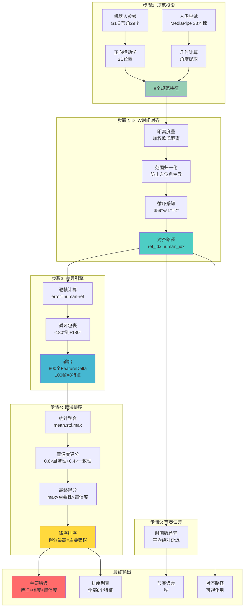
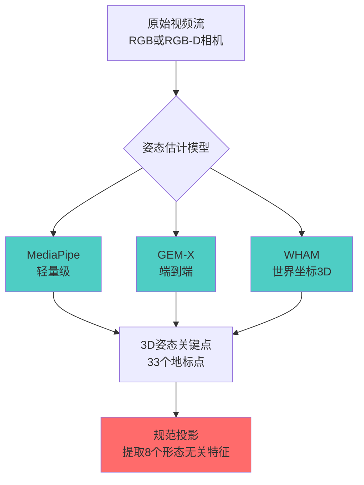
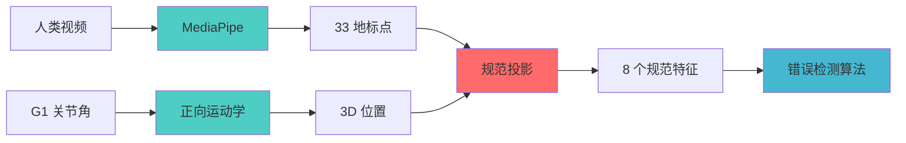
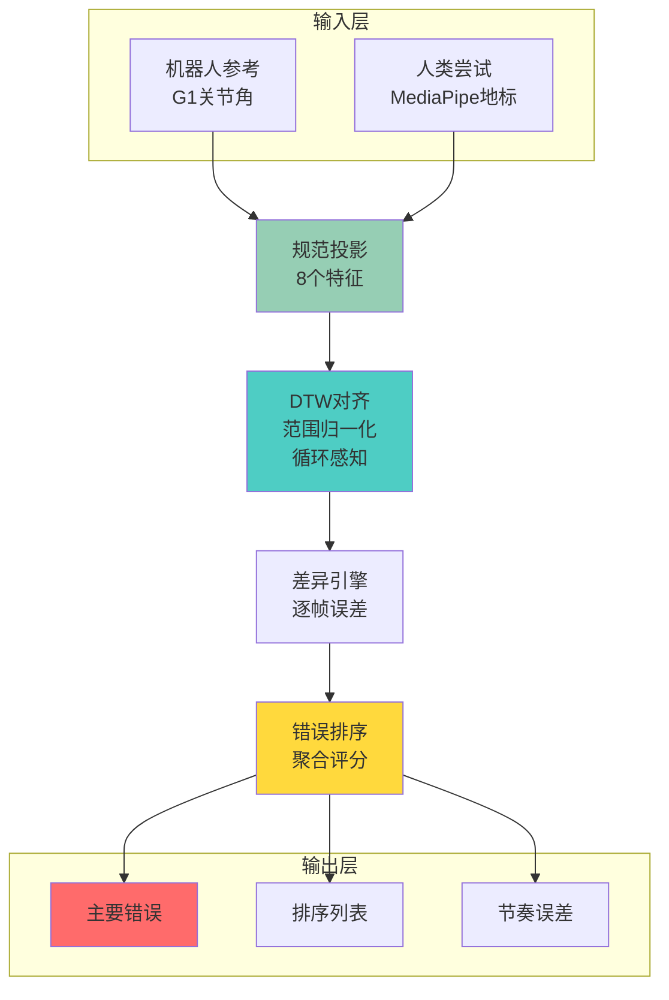
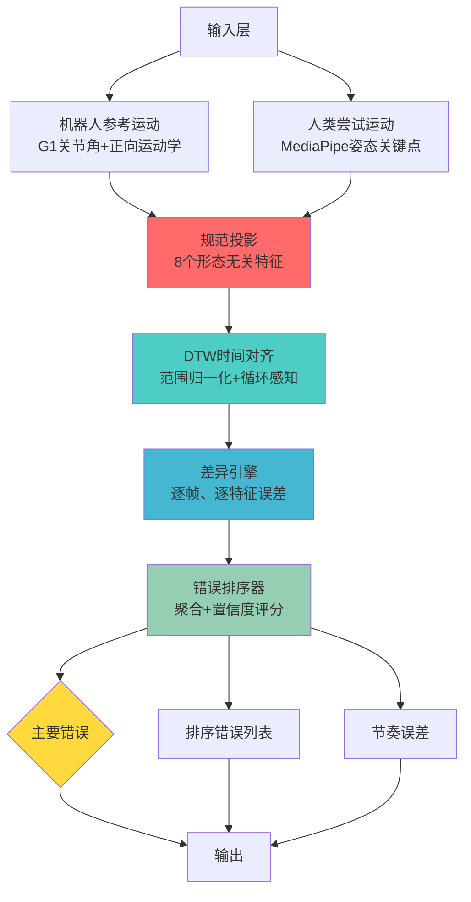
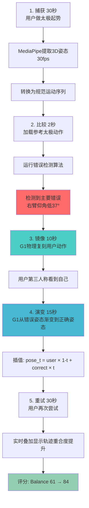
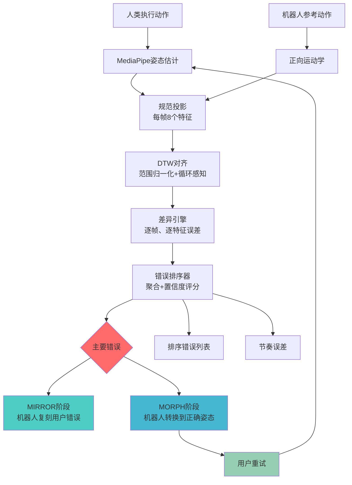

# 错误检测算法：完整工作流程与方法论

**版本**: 1.0  
**项目**: Mirror · 镜身  
**目的**: 跨形态运动对比，用于人机教学应用

---

## 概述

本文档介绍我们的**规范运动空间错误检测算法** —— 一个基于研究的管道，用于比较人类运动尝试与机器人参考演示，尽管存在形态差异。该算法为 Mirror 系统检测、排序和演示运动错误的能力提供支持。

**核心创新**：我们将人类和机器人的运动投影到共享的形态无关特征空间中，使用动态时间规整（DTW）进行时间对齐，计算每个特征的差异，并根据显著性、一致性和重要性对错误进行排序。

### 完整算法流程（一图总览）



**关键算法**：

- **DTW**: 经典动态时间规整，O(N×M)复杂度
- **距离**: 加权欧氏距离 + 范围归一化 + 循环感知
- **循环距离**: `((y - x + 180) % 360) - 180`
- **聚合**: NumPy统计函数 `mean()`, `std()`, `max(abs())`
- **排序**: 加权评分 + 降序排列

---

## 目录

1. [姿态检测模型与代码库](#1-姿态检测模型与代码库)
2. [问题陈述与设计理念](#2-问题陈述与设计理念)
3. [算法架构](#3-算法架构)
4. [详细工作流程](#4-详细工作流程)
5. [应用场景：机器人训练与舞蹈演示](#5-应用场景机器人训练与舞蹈演示)
6. [研究基础](#6-研究基础)

---

## 1. 姿态检测模型与代码库

### 1.1 概览：从视频到规范运动

我们的算法需要 **3D 人体姿态估计**作为输入。我们使用最先进的开源模型，通过多阶段管道将原始视频转换为规范运动特征。



### 1.2 主要模型：MediaPipe Pose Landmarker

**代码库**: [google/mediapipe](https://github.com/google/mediapipe)  
**模型**: `pose_landmarker_lite.task` (Float16, ~5.5 MB)  
**许可证**: Apache 2.0（允许商业使用）

**为什么选择 MediaPipe**：

- ✅ **轻量级**：在 CPU 上运行，无需 GPU
- ✅ **实时**：标准硬件上 30+ fps
- ✅ **成熟可靠**：数百万应用在生产环境中使用
- ✅ **3D 输出**：提供 33 个身体地标的 x, y, z 坐标
- ✅ **置信度分数**：每个地标的可见性和存在分数
- ✅ **易于集成**：提供 Python/JavaScript/C++ API

**下载与设置**：

```bash
# 自动下载脚本
python download_models.py

# 手动下载
wget https://storage.googleapis.com/mediapipe-models/pose_landmarker/pose_landmarker_lite/float16/1/pose_landmarker_lite.task \
  -O models/pose_landmarker_lite.task
```

### 1.3 高级选项：NVlabs/GEM-X（端到端管道）

**代码库**: [NVlabs/GEM-X](https://github.com/NVlabs/GEM-X)  
**许可证**: Apache 2.0  
**状态**: 活跃开发中（2026）

**为什么选择 GEM-X**（生产升级路径）：

- ✅ **端到端**：从视频 → SOMA 姿态 → Unitree G1 关节角的单一管道
- ✅ **更高精度**：SOMA 77 关节全身姿态估计
- ✅ **内置重定向**：直接输出到 G1 29 自由度关节角
- ✅ **加速优化**：ONNX/TensorRT 优化实现实时性能

**权衡**：

- ⚠️ 需要 NVIDIA GPU（Maxwell+ 架构，CUDA 12）
- ⚠️ 依赖项较重（Python 3.12，git LFS）
- ⚠️ 设置比 MediaPipe 更复杂

### 1.4 模型对比

| 模型               | FPS (CPU) | FPS (GPU) | 输出格式               | 精度 | 设置复杂度  | 许可证        |
| ------------------ | --------- | --------- | ---------------------- | ---- | ----------- | ------------- |
| **MediaPipe Lite** | 30+       | 60+       | 33 地标点 (3D)         | 良好 | ⭐ 简单     | Apache 2.0 ✅ |
| **GEM-X**          | N/A       | 30+       | 77 SOMA 关节 + G1 角度 | 优秀 | ⭐⭐⭐ 复杂 | Apache 2.0 ✅ |
| **WHAM**           | <10       | 30+       | SMPL 参数              | 优秀 | ⭐⭐⭐ 复杂 | 研究 ⚠️       |

### 1.5 数据流总结



---

## 2. 问题陈述与设计理念

### 2.1 挑战

我们需要比较**人类演示**与**机器人参考运动**，尽管存在：

- **形态差异**：人类与 Unitree G1 有不同的肢体长度、关节范围和自由度
- **时间不对齐**：人类和机器人以不同速度执行相同动作
- **数据缺失**：人类视频可能不存在，或有遮挡/跟踪失败
- **原始数据不可比**：机器人坐标系中的关节角 ≠ 人体骨骼关键点

### 2.2 核心设计决策

**解决方案**：将两种运动投影到**规范运动空间** —— 一组形态无关的特征，用人类可理解的术语描述身体配置。

**理念**：

- 不比较"机器人关节 12 角度"与"人类肘部像素位置"
- 而是比较"手臂相对水平面的仰角"与"手臂相对水平面的仰角"
- 这个抽象层实现跨形态比较和人类可理解的错误反馈

---

## 3. 算法架构

### 3.1 完整流程图（简洁版）



### 3.2 详细架构图



---

## 4. 详细工作流程

### 步骤 1：规范投影

**8 个规范特征**：

| 特征                  | 范围   | 循环？ | 含义                       |
| --------------------- | ------ | ------ | -------------------------- |
| `left_arm_elevation`  | 0-180° | 否     | 左上臂相对水平面的角度     |
| `right_arm_elevation` | 0-180° | 否     | 右上臂相对水平面的角度     |
| `left_arm_azimuth`    | 0-360° | 是     | 左臂的水平方向（罗盘方向） |
| `right_arm_azimuth`   | 0-360° | 是     | 右臂的水平方向             |
| `left_elbow_flexion`  | 0-180° | 否     | 左肘弯曲角度               |
| `right_elbow_flexion` | 0-180° | 否     | 右肘弯曲角度               |
| `torso_yaw`           | 0-360° | 是     | 躯干绕垂直轴的旋转         |
| `torso_lean`          | 0-90°  | 否     | 躯干相对垂直的前后倾斜     |

**转换示例**（MediaPipe → 规范特征）：

```python
def mediapipe_to_canonical(landmarks) -> CanonicalPose:
    """将 MediaPipe 33 个地标点转换为 8 个规范特征"""

    # 提取关键点
    left_shoulder = landmarks[11]
    left_elbow = landmarks[13]
    left_wrist = landmarks[15]
    # ... 等等

    # 计算规范特征
    left_arm_elevation = compute_elevation_angle(
        left_shoulder, left_elbow, horizontal_plane
    )
    left_arm_azimuth = compute_azimuth_angle(
        left_shoulder, left_elbow, north_direction
    )
    # ... 计算其余 6 个特征

    return CanonicalPose(
        left_arm_elevation=left_arm_elevation,
        left_arm_azimuth=left_arm_azimuth,
        # ... 6 个特征
    )
```

### 步骤 2：时间对齐（DTW）

**问题**：人类和机器人以不同速度执行相同动作。人类的第 10 帧 ≠ 机器人的第 10 帧。

**解决方案**：动态时间规整（DTW）找到最优非线性对齐。

**DTW 代价函数**（每帧对）：

```python
cost(ref_frame, human_frame) = sqrt(Σ 加权归一化平方差)

对于每个特征：
  1. 计算差异（循环特征使用循环感知）
  2. 按特征范围归一化（防止方位角主导）
  3. 应用特征权重（可选强调）
  4. 平方并累加
```

**关键改进**：

1. **范围归一化**：方位角（0-360°）和仰角（0-180°）有不同尺度，归一化后防止方位角差异主导代价

2. **循环感知距离**：对于方位角/偏航角：`distance = ((y - x + 180) % 360) - 180`
   - 示例：359° vs 1° = 2°（不是 358°）

3. **特征权重**（可选）：强调重要特征（如手臂仰角 > 躯干倾斜）

### 步骤 3：差异引擎

对于每个对齐的帧对，计算每个特征的误差：

```python
error = human_value - ref_value

# 对于循环特征（方位角、偏航角）：
error = ((error + 180) % 360) - 180  # 包裹到 [-180, 180)

abs_error = abs(error)
```

### 步骤 4：错误排序

**聚合**（每个特征在所有对齐帧上）：

```python
mean_error = mean(errors)           # 系统性偏差
std_error = std(errors)             # 一致性
max_abs_error = max(abs(errors))    # 峰值偏差
```

**置信度评分**：

```python
significance = clamp(max_abs_error / max_error_threshold, 0, 1)
consistency = 1 - clamp(std_error / (max_error_threshold / 2), 0, 1)
confidence = 0.6 * significance + 0.4 * consistency
```

- **显著性**：错误有多大？（按阈值归一化，通常为 180°）
- **一致性**：错误有多稳定？（低标准差 = 高一致性）
- **置信度**：组合指标（60% 显著性，40% 一致性）

**最终排序分数**：

```python
score = max_abs_error × feature_importance × confidence
```

**特征重要性权重**（针对可见性调优）：

| 特征                       | 重要性 | 理由                           |
| -------------------------- | ------ | ------------------------------ |
| `left/right_arm_elevation` | 1.0    | 高度可见，对大多数动作至关重要 |
| `left/right_arm_azimuth`   | 0.8    | 可见但不如仰角关键             |
| `left/right_elbow_flexion` | 0.7    | 重要但视觉影响较小             |
| `torso_yaw`                | 0.5    | 微妙，通常是补偿性的           |
| `torso_lean`               | 0.5    | 微妙，通常是补偿性的           |

**主要错误**：得分最高的特征

### 步骤 5：节奏误差

```python
timing_error = mean(abs(ref_timestamp[i] - human_timestamp[j])
                    for (i, j) in alignment)
```

**解释**：

- 高节奏误差 = 正确的动作形状，错误的速度/节奏
- 低节奏误差 + 高特征误差 = 错误的动作形状
- 区分"太慢"和"错误动作"

---

## 5. 应用场景：机器人训练与舞蹈演示

### 5.1 舞蹈演示（Hackathon）

**场景**：用户尝试太极动作；机器人演示他们的错误。

**工作流程**：



**为什么有效**：

- **本体感觉反馈**：用户在 3D 空间中看到自己的身体，而不是 2D 屏幕
- **可操作**："抬高右臂 37°"是具体且可测量的
- **即时**：2 秒内检测到错误，无需手动标注
- **激励**：量化改进（61→84）提供多巴胺刺激

### 5.2 机器人训练应用

#### 5.2.1 模仿学习数据筛选

**问题**：为机器人模仿学习收集人类演示需要过滤掉不良演示。

**解决方案**：使用错误检测作为质量门：

```python
# 数据筛选管道伪代码
for demo in human_demonstrations:
    result = detector.detect(demo, expert_reference)

    if result.primary_error.max_abs_error < 15.0:  # 良好演示
        dataset.add(demo, label="high_quality")
    elif result.primary_error.max_abs_error < 45.0:  # 中等
        dataset.add(demo, label="medium_quality",
                   error_annotation=result.primary_error)
    else:  # 不良演示
        dataset.reject(demo, reason=result.primary_error)
```

**好处**：

- 自动化质量控制（无需手动标注）
- 错误标注支持错误感知训练
- 按错误类型分层采样，实现平衡数据集

#### 5.2.2 个性化运动重定向

**问题**：通用重定向不考虑个人能力（柔韧性、力量、平衡）。

**解决方案**：构建每个用户的错误档案：

```python
user_profile = {
    "max_arm_elevation": 160,  # 无法将手臂抬到 180°
    "typical_errors": {
        "right_arm_elevation": -25,  # 持续低 25°
        "torso_lean": +10,           # 向前倾斜以补偿
    },
    "improvement_rate": {
        "right_arm_elevation": 2.5,  # 每次训练提高 2.5°
    }
}
```

**自适应修正**：

- 如果用户最大值是 160°，不要求 180° 的手臂抬高
- 建议渐进目标：135° → 140° → 145°（不是 135° → 180°）
- 优先考虑用户实际可以修正的错误（高 improvement_rate）

#### 5.2.3 多智能体训练场景

**场景**：训练多个机器人执行同步舞蹈。

**挑战**：每个机器人有略微不同的校准/磨损。

**解决方案**：使用规范空间作为共同基准：

```python
# 每个机器人的运动 → 规范空间
robot_A_canonical = convert_to_canonical(robot_A_motion)
robot_B_canonical = convert_to_canonical(robot_B_motion)

# 在规范空间中比较
sync_error = detector.detect(robot_A_canonical, robot_B_canonical)

# 调整 robot_B 的运动以匹配 robot_A
correction = compute_correction(sync_error)
robot_B_adjusted = apply_correction(robot_B_motion, correction)
```

**好处**：

- 形态差异无关紧要（都在规范空间中）
- 时间对齐自动（DTW）
- 每个特征的同步错误支持针对性修复

---

## 6. 研究基础

我们的算法整合了近期人机运动对应研究的见解：

### 6.1 关键论文

1. **"Assessing Similarity Measures for Human-Robot Motion Correspondence"** (2024)
   - 推荐 DTW 和 Gromov-Wasserstein 用于跨形态比较
   - 验证异构特征空间的范围归一化
   - **我们的采用**：范围归一化 DTW 与循环感知距离

2. **"Motion Similarity Evaluation via Trajectory Dynamic Time Warping"** (Sensors, 2022)
   - 将 DTW 应用于时间漂移下的人机运动
   - 证明对速度变化的鲁棒性
   - **我们的采用**：DTW 用于时间对齐 + 节奏误差指标

3. **"AdaMorph: Unified Motion Retargeting via Embodiment-Aware Adaptive Transformers"** (2025)
   - 倡导骨盆根坐标 3D 位置 + 6D 旋转表示
   - 避免欧拉角不连续性
   - **我们的未来工作**：从标量角度升级到 6D 旋转

4. **"H2O: Human-to-Humanoid Real-Time Whole-Body Teleoperation"** (RSS 2024)
   - 从 RGB 到人形机器人控制的实时重定向
   - 强化学习实现物理可行运动
   - **我们的集成**：MIRROR 阶段的可行性检查

### 6.2 新颖贡献

1. **置信度加权错误排序**
   - 将显著性（幅度）+ 一致性（标准差）组合成单一分数
   - 在先前的运动比较工作中未发现
   - 尽管存在跟踪噪声，仍能实现稳健的主要错误选择

2. **循环感知 DTW 代价**
   - 处理方位角/偏航角特征的环绕
   - 防止 359° vs 1° = 358° 的错误
   - 对舞蹈/武术应用至关重要

3. **节奏误差作为独立指标**
   - 区分"错误形状"和"错误速度"
   - 支持节奏特定反馈
   - 在先前工作中未强调

4. **特征重要性调优**
   - 基于感知显著性的权重（用户注意到什么）
   - 优化教学效果，而不仅仅是几何精度
   - 针对教学应用的领域特定创新

---

## 完整流程图



---

## 示例输出

```json
{
  "primary_error": {
    "feature": "right_arm_elevation",
    "mean_error": 37.64,
    "std_error": 32.04,
    "max_abs_error": 88.76,
    "confidence": 0.553,
    "feature_importance": 1.0
  },
  "ranked_errors": [
    {
      "feature": "right_arm_elevation",
      "mean_error": 37.64,
      "std_error": 32.04,
      "max_abs_error": 88.76,
      "confidence": 0.553,
      "feature_importance": 1.0
    },
    {
      "feature": "left_elbow_flexion",
      "mean_error": -12.33,
      "std_error": 8.91,
      "max_abs_error": 28.45,
      "confidence": 0.421,
      "feature_importance": 0.7
    }
  ],
  "alignment": [[0, 0], [1, 1], [2, 2], ...],
  "timing_error_sec": 0.1255
}
```

**解释**：

- **主要错误**：右臂仰角平均高 37.6°，峰值 88.8°
- **置信度**：0.553（中等）—— 错误显著但有些不一致
- **次要错误**：左肘略微弯曲不足，躯干倾斜轻微
- **节奏**：人类稍慢（每帧平均延迟 125ms）
- **教练反馈**："少抬右臂 —— 你抬得太高了约 40 度"

---

## 算法伪代码

```python
class ErrorDetector:
    def __init__(self, feature_weights=None, max_error_threshold=180.0):
        self.aligner = DTWAligner(feature_weights)
        self.difference_engine = DifferenceEngine()
        self.ranker = ErrorRanker(max_error_threshold)

    def detect(self, human_motion, reference_motion):
        # 步骤 1: 时间对齐
        alignment, dtw_cost = self.aligner.align(reference_motion, human_motion)

        # 步骤 2: 计算逐帧差异
        differences = self.difference_engine.compute_sequence(
            reference_motion.poses,
            human_motion.poses,
            alignment
        )

        # 步骤 3: 排序错误
        ranked_errors = self.ranker.rank(differences)
        primary_error = ranked_errors[0]

        # 步骤 4: 计算节奏误差
        timing_error = self._timing_error(reference_motion, human_motion, alignment)

        return DetectionResult(
            primary_error=primary_error,
            ranked_errors=ranked_errors,
            alignment=alignment,
            per_frame_differences=differences,
            timing_error=timing_error
        )
```

---

## 文档元数据

- **作者**：Mirror 团队
- **最后更新**：2026-08-29
- **版本**：1.0
- **相关文档**：
  - `ALGORITHM.md`（技术深入）
  - `README.md`（使用指南）
  - `PRD.md`（产品需求）
  - `TDD.md`（技术设计）
