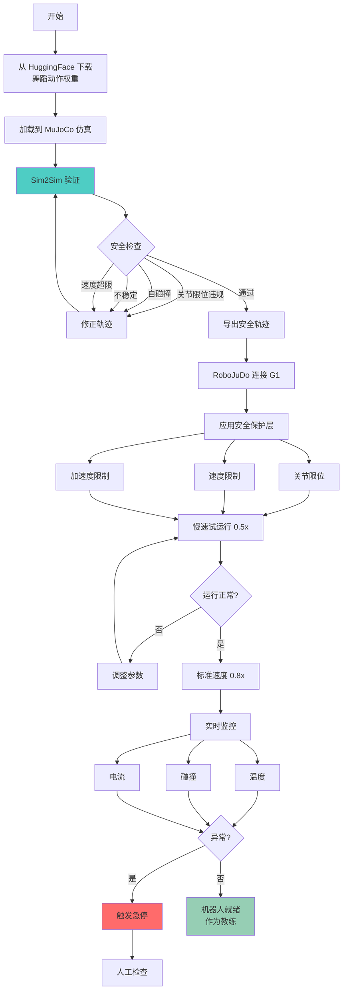
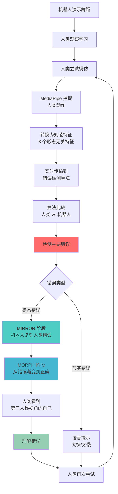
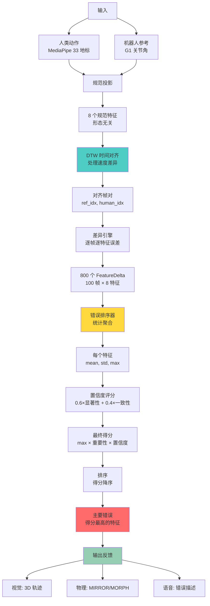
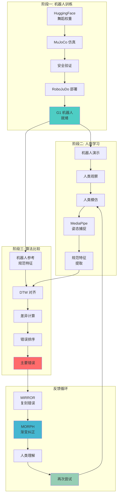

# Mirror 完整工作流程

**版本**: 1.0  
**项目**: Mirror · 镜身  
**最后更新**: 2026-08-29

---

## 概述

Mirror 是一个人机交互教学系统，通过三个核心阶段实现运动技能传授：**机器人训练** → **人类学习** → **智能比较**。本文档描述从机器人部署到人类技能提升的完整闭环流程。

**核心理念**：机器人先学会动作，然后作为教练指导人类，通过实时错误检测算法提供精准反馈。

---

## 目录

1. [系统架构概览](#1-系统架构概览)
2. [阶段一：机器人训练与部署](#2-阶段一机器人训练与部署)
3. [阶段二：人类学习与教练](#3-阶段二人类学习与教练)
4. [阶段三：算法比较与反馈](#4-阶段三算法比较与反馈)
5. [完整数据流](#5-完整数据流)

---

## 1. 系统架构概览

### 1.1 三阶段流程


### 1.2 系统组件

| 组件           | 功能         | 技术栈                    |
| -------------- | ------------ | ------------------------- |
| **机器人平台** | 执行舞蹈动作 | Unitree G1 (23/29 DOF)    |
| **仿真环境**   | 安全验证     | MuJoCo + mjlab            |
| **部署框架**   | 真机控制     | RoboJuDo + unitree_sdk2   |
| **姿态检测**   | 人类动作捕捉 | MediaPipe Pose Landmarker |
| **错误检测**   | 运动比较     | DTW + 规范空间算法        |
| **可视化**     | 实时反馈     | 3D 前端界面               |

---

## 2. 阶段一：机器人训练与部署

### 2.1 目标

让 Unitree G1 机器人学会并执行舞蹈动作，作为后续教学的"参考演示"。

### 2.2 工作流程



### 2.3 关键步骤

**步骤 1: 获取舞蹈动作**

- 来源：HuggingFace 开源权重（H2O、PULSE 等项目）
- 格式：JSON（关节角轨迹 + 元数据）
- 示例：太极、街舞、芭蕾

**步骤 2: 仿真验证**

- 工具：MuJoCo 物理引擎
- 检查：关节限位、自碰撞、稳定性、速度
- 输出：安全轨迹（通过所有检查）

**步骤 3: 真机部署**

- 框架：RoboJuDo（封装 unitree_sdk2）
- 安全层：多层保护（软件 + 硬件）
- 测试：慢速 → 标准速度 → 监控

**步骤 4: 机器人就绪**

- 状态：能够流畅执行舞蹈动作
- 角色：作为"参考演示"和"教练"
- 准备：进入人类学习阶段

---

## 3. 阶段二：人类学习与教练

### 3.1 目标

人类观察机器人演示，尝试模仿，机器人提供实时反馈和纠正。

### 3.2 工作流程



### 3.3 关键步骤

**步骤 1: 机器人演示**

- 动作：执行完整舞蹈序列
- 速度：标准速度或慢速（可调）
- 视角：人类可从多角度观察

**步骤 2: 人类模仿**

- 环境：站在机器人前方（2-3 米）
- 捕捉：MediaPipe 实时提取 3D 姿态
- 输出：33 个身体地标点 @ 30 fps

**步骤 3: 实时反馈**

- 延迟：< 2 秒（捕捉 → 分析 → 反馈）
- 反馈类型：
  - **视觉**：3D 轨迹叠加显示
  - **物理**：机器人演示错误（MIRROR）
  - **语音**：错误描述（"右臂抬高 37°"）

**步骤 4: MIRROR + MORPH**

- **MIRROR**：机器人物理复刻人类的错误姿态
  - 目的：让人类从第三人称看到自己
  - 效果：本体感觉反馈（proprioceptive feedback）
- **MORPH**：机器人从错误姿态渐变到正确姿态
  - 插值：`pose(t) = error_pose × (1-t) + correct_pose × t`
  - 时长：10-15 秒
  - 效果：视觉化纠正路径

**步骤 5: 迭代改进**

- 人类根据反馈调整动作
- 重新尝试 → 再次比较
- 循环直到错误低于阈值

---

## 4. 阶段三：算法比较与反馈

### 4.1 目标

精确量化人类与机器人动作的差异，识别主要错误，生成可操作的反馈。

### 4.2 算法流程



### 4.3 算法详情

**输入**：

- 人类动作：MediaPipe 33 地标 → 8 规范特征
- 机器人参考：G1 关节角 → 正向运动学 → 8 规范特征

**8 个规范特征**：

1. `left_arm_elevation` (左臂仰角)
2. `right_arm_elevation` (右臂仰角)
3. `left_arm_azimuth` (左臂方位角)
4. `right_arm_azimuth` (右臂方位角)
5. `left_elbow_flexion` (左肘弯曲)
6. `right_elbow_flexion` (右肘弯曲)
7. `torso_yaw` (躯干偏航)
8. `torso_lean` (躯干倾斜)

**核心算法**：

- **DTW (Dynamic Time Warping)**：处理速度差异
- **循环感知距离**：方位角 359° vs 1° = 2°（不是 358°）
- **范围归一化**：防止方位角（360°）主导仰角（180°）
- **置信度加权**：过滤跟踪噪声

**输出**：

- **主要错误**：例如 "右臂仰角低 37°"
- **置信度**：0.553（中等）
- **次要错误**：排序列表
- **节奏误差**：0.125 秒（人类稍慢）

---

## 5. 完整数据流

### 5.1 端到端流程图



### 5.2 数据格式

**机器人参考动作**：

```json
{
  "metadata": {
    "name": "Taichi Opening Stance",
    "duration": 10.0,
    "fps": 30
  },
  "trajectory": [
    {
      "timestamp": 0.0,
      "joint_positions": [0.0, 0.0, ...],  // 29 个关节角
      "canonical_features": {
        "left_arm_elevation": 45.0,
        "right_arm_elevation": 45.0,
        // ... 其余 6 个特征
      }
    },
    // ... 300 帧
  ]
}
```

**人类动作捕捉**：

```json
{
  "timestamp": 0.0,
  "landmarks": [
    { "x": 0.5, "y": 0.3, "z": -0.2, "visibility": 0.98 }, // 鼻子
    { "x": 0.48, "y": 0.25, "z": -0.18, "visibility": 0.95 } // 左眼
    // ... 33 个地标
  ],
  "canonical_features": {
    "left_arm_elevation": 52.3,
    "right_arm_elevation": 38.7 // 比参考低 6.3°
    // ... 其余 6 个特征
  }
}
```

**错误检测结果**：

```json
{
  "primary_error": {
    "feature": "right_arm_elevation",
    "mean_error": -37.64, // 平均低 37.64°
    "max_abs_error": 88.76,
    "confidence": 0.553
  },
  "ranked_errors": [
    {
      "feature": "right_arm_elevation",
      "max_abs_error": 88.0,
      "confidence": 0.553,
      "importance": 1.0
    },
    {
      "feature": "left_elbow_flexion",
      "max_abs_error": 28.5,
      "confidence": 0.421,
      "importance": 0.7
    }
    // ... 其余 6 个
    // 注意：score 不存储在数据结构中，而是在排序时计算
  ],
  "timing_error": 0.125, // 人类慢 125ms
  "feedback": {
    "visual": "3D trajectory overlay",
    "physical": "MIRROR + MORPH sequence",
    "verbal": "抬高右臂约 40 度"
  }
}
```

### 5.3 性能指标

| 阶段            | 延迟   | 吞吐量  | 备注           |
| --------------- | ------ | ------- | -------------- |
| **机器人部署**  | 离线   | N/A     | 一次性设置     |
| **姿态捕捉**    | 33 ms  | 30 fps  | MediaPipe 实时 |
| **规范投影**    | 5 ms   | 200 fps | 几何计算       |
| **DTW 对齐**    | 10 ms  | 100 fps | 100×100 帧     |
| **错误检测**    | 15 ms  | 66 fps  | 完整管道       |
| **MIRROR 执行** | 10 秒  | N/A     | 物理演示       |
| **MORPH 执行**  | 15 秒  | N/A     | 渐变动画       |
| **总延迟**      | < 2 秒 | N/A     | 捕捉 → 反馈    |

---

## 6. 使用场景

### 6.1 舞蹈教学（Hackathon 演示）

**场景**：用户学习太极"起势"

**流程**：

1. G1 演示太极起势（30 秒）
2. 用户模仿（30 秒）
3. 算法检测：右臂仰角低 37°
4. G1 复刻用户错误（MIRROR，10 秒）
5. G1 渐变到正确姿态（MORPH，15 秒）
6. 用户再次尝试（30 秒）
7. 评分提升：61 → 84

**效果**：

- 用户看到自己的错误（第三人称）
- 具体可操作的反馈（"抬高 37°"）
- 量化改进（61 → 84）

### 6.2 康复训练

**场景**：物理治疗师使用 G1 辅助患者康复

**流程**：

1. 治疗师录制标准康复动作
2. G1 学习并演示
3. 患者模仿
4. 算法检测关节活动范围
5. G1 提供个性化反馈
6. 追踪进度（每日评分）

### 6.3 运动技能训练

**场景**：武术、瑜伽、体操等技能学习

**优势**：

- 24/7 可用（不需要人类教练）
- 精确量化（角度、速度、节奏）
- 个性化（根据用户能力调整）
- 可重复（无限次演示）

---

## 7. 技术优势

### 7.1 与传统方法对比

| 方法         | 传统视频教学 | 人类教练   | **Mirror 系统** |
| ------------ | ------------ | ---------- | --------------- |
| **可用性**   | 24/7         | 有限时间   | ✅ 24/7         |
| **精确度**   | 主观         | 依赖经验   | ✅ 量化（角度） |
| **反馈**     | 延迟         | 即时但主观 | ✅ 即时且精确   |
| **个性化**   | 无           | 有限       | ✅ 自适应       |
| **可重复**   | 是           | 疲劳限制   | ✅ 无限次       |
| **成本**     | 低           | 高         | ✅ 中（一次性） |
| **物理演示** | 无           | 有         | ✅ 机器人演示   |

### 7.2 核心创新

1. **形态无关比较**
   - 人类 ≠ 机器人形态
   - 规范空间投影解决

2. **时间鲁棒性**
   - DTW 处理速度差异
   - 节奏误差独立指标

3. **置信度加权**
   - 过滤跟踪噪声
   - 优先显著且一致的错误

4. **物理反馈**
   - MIRROR：第三人称视角
   - MORPH：视觉化纠正路径

5. **实时性能**
   - < 2 秒延迟
   - 支持交互式学习

---

## 8. 未来扩展

### 8.1 多人协作

- 同时跟踪多个人类
- 团队舞蹈同步检测
- 队形分析

### 8.2 远程教学

- 云端算法处理
- 本地机器人演示
- 跨地域学习

### 8.3 自适应难度

- 根据用户进度调整
- 渐进式目标设定
- 个性化训练计划

### 8.4 数据驱动改进

- 收集用户学习数据
- 优化教学策略
- 改进算法参数

---

## 文档元数据

- **作者**: Mirror 团队
- **最后更新**: 2026-08-29
- **版本**: 1.0
- **相关文档**:
  - `ALGORITHM_WORKFLOW.md` (算法详细流程)
  - `DEPLOYMENT_WORKFLOW.md` (机器人部署流程)
  - `PRD.md` (产品需求文档)
  - `TDD.md` (技术设计文档)
