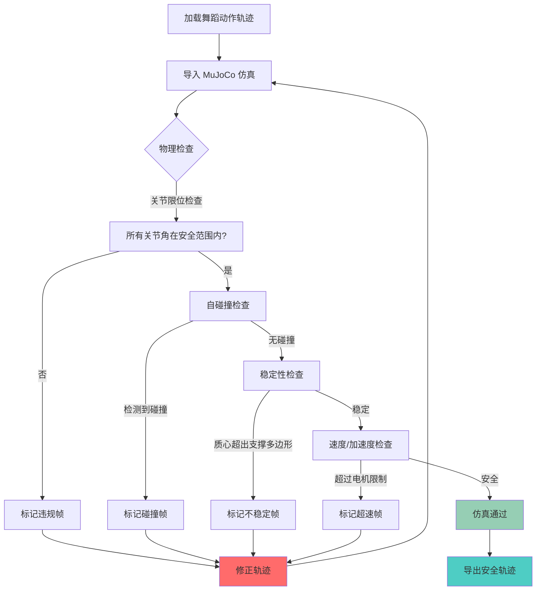
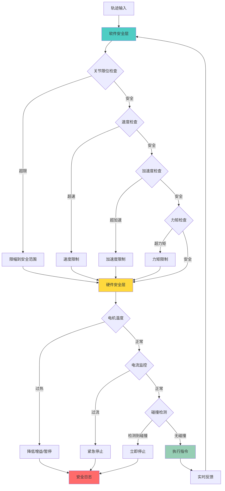
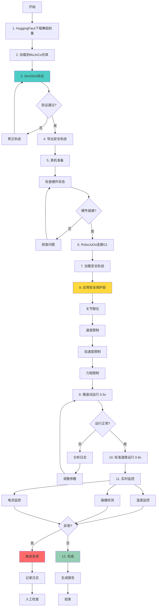
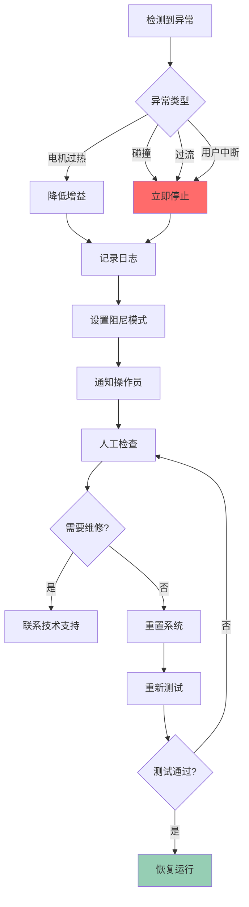

# G1 实机部署工作流程

**版本**: 1.0  
**项目**: Mirror · 镜身  
**目标硬件**: Unitree G1 (23/29 DOF)  
**最后更新**: 2026-08-29

---

## 概述

本文档详细介绍从仿真到实机部署的完整工作流程，包括 MuJoCo 仿真验证、RoboJuDo 真机部署、舞蹈动作权重加载以及电机安全保护措施。

**核心理念**：**Sim2Real** —— 先在仿真环境中验证动作的安全性和可行性，再部署到真机，最大程度降低硬件损坏风险。

---

## 目录

1. [技术栈概览](#1-技术栈概览)
2. [仿真阶段：MuJoCo mjlab](#2-仿真阶段mujoco-mjlab)
3. [真机部署：RoboJuDo](#3-真机部署robojudo)
4. [舞蹈动作权重加载](#4-舞蹈动作权重加载)
5. [电机安全保护措施](#5-电机安全保护措施)
6. [完整部署流程](#6-完整部署流程)
7. [故障排查与应急预案](#7-故障排查与应急预案)

---

## 1. 技术栈概览

### 1.1 核心组件

| 组件 | 用途 | 版本/来源 | 许可证 |
|------|------|----------|--------|
| **MuJoCo** | 物理仿真引擎 | 3.0+ | Apache 2.0 |
| **mjlab** | MuJoCo 可视化界面 | 内置于 MuJoCo | Apache 2.0 |
| **RoboJuDo** | G1 真机部署框架 | GitHub: robojudo/robojudo | MIT |
| **unitree_sdk2** | G1 底层控制接口 | Unitree 官方 | Proprietary |
| **HuggingFace Hub** | 舞蹈动作权重仓库 | 开源社区 | 各模型不同 |

### 1.2 硬件要求

**仿真环境**：
- CPU: Intel i5 或更高
- RAM: 8GB+
- GPU: 可选（加速渲染）
- OS: Linux (Ubuntu 20.04+) / macOS / Windows

**真机部署**：
- Unitree G1 机器人
- 控制计算机（与 G1 同网段）
- 急停设备（手持遥控器）
- 安全围栏（2m × 2m 最小）

---

## 2. 仿真阶段：MuJoCo mjlab

### 2.1 为什么使用 MuJoCo

**MuJoCo (Multi-Joint dynamics with Contact)** 是业界领先的物理仿真引擎，特别适合人形机器人仿真：

- ✅ **高精度物理**：精确的接触力、摩擦力、关节动力学模拟
- ✅ **实时性能**：支持实时仿真（1000+ Hz）
- ✅ **G1 官方支持**：Unitree 提供 G1 的 MuJoCo MJCF 模型文件
- ✅ **可视化工具**：mjlab 提供交互式 3D 查看器
- ✅ **开源免费**：Apache 2.0 许可证（2022 年被 DeepMind 开源）

### 2.2 MuJoCo 环境搭建

**安装 MuJoCo**：

```bash
# 方法 1: pip 安装（推荐）
pip install mujoco

# 方法 2: 从源码编译
git clone https://github.com/deepmind/mujoco.git
cd mujoco
mkdir build && cd build
cmake ..
make -j4
sudo make install
```

**获取 G1 模型文件**：

```bash
# 从 Unitree 官方仓库下载
git clone https://github.com/unitreerobotics/unitree_mujoco.git
cd unitree_mujoco

# G1 模型位置
ls models/g1/  # g1_29dof.xml (完整版) 或 g1_23dof.xml (简化版)
```

**启动 mjlab 仿真**：

```bash
# 启动 MuJoCo 可视化界面
python -m mujoco.viewer

# 或使用命令行加载模型
mujoco models/g1/g1_29dof.xml
```

### 2.3 Sim2Sim 验证流程

**目标**：在仿真中验证动作的物理可行性，避免真机损坏。

**验证步骤**：



**Python 实现示例**：

```python
import mujoco
import numpy as np

def validate_trajectory_in_sim(trajectory, model_path="models/g1/g1_29dof.xml"):
    """在 MuJoCo 中验证轨迹安全性"""
    
    # 加载 G1 模型
    model = mujoco.MjModel.from_xml_path(model_path)
    data = mujoco.MjData(model)
    
    violations = []
    
    for frame_idx, joint_angles in enumerate(trajectory):
        # 设置关节角
        data.qpos[:len(joint_angles)] = joint_angles
        
        # 前向运动学
        mujoco.mj_forward(model, data)
        
        # 检查 1: 关节限位
        for i, (q, qmin, qmax) in enumerate(zip(data.qpos, model.jnt_range[:, 0], model.jnt_range[:, 1])):
            if q < qmin or q > qmax:
                violations.append({
                    "frame": frame_idx,
                    "type": "joint_limit",
                    "joint": i,
                    "value": q,
                    "range": (qmin, qmax)
                })
        
        # 检查 2: 自碰撞
        if data.ncon > 0:  # 存在接触
            for i in range(data.ncon):
                contact = data.contact[i]
                if contact.dist < 0:  # 穿透
                    violations.append({
                        "frame": frame_idx,
                        "type": "self_collision",
                        "geom1": contact.geom1,
                        "geom2": contact.geom2,
                        "penetration": -contact.dist
                    })
        
        # 检查 3: 质心稳定性
        com = data.subtree_com[0]  # 全身质心
        foot_positions = get_foot_positions(data)
        support_polygon = compute_support_polygon(foot_positions)
        
        if not point_in_polygon(com[:2], support_polygon):
            violations.append({
                "frame": frame_idx,
                "type": "instability",
                "com": com,
                "support_polygon": support_polygon
            })
        
        # 检查 4: 速度限制（如果有前一帧）
        if frame_idx > 0:
            dt = 1.0 / 30.0  # 假设 30 fps
            velocities = (joint_angles - trajectory[frame_idx - 1]) / dt
            max_vel = 3.0  # rad/s，根据 G1 规格调整
            
            if np.any(np.abs(velocities) > max_vel):
                violations.append({
                    "frame": frame_idx,
                    "type": "velocity_limit",
                    "max_velocity": np.max(np.abs(velocities)),
                    "limit": max_vel
                })
    
    return violations

def get_foot_positions(data):
    """获取双脚位置"""
    # 根据 G1 模型的 body 名称获取
    left_foot_id = mujoco.mj_name2id(data.model, mujoco.mjtObj.mjOBJ_BODY, "left_ankle")
    right_foot_id = mujoco.mj_name2id(data.model, mujoco.mjtObj.mjOBJ_BODY, "right_ankle")
    
    return [
        data.xpos[left_foot_id],
        data.xpos[right_foot_id]
    ]

def compute_support_polygon(foot_positions):
    """计算支撑多边形（简化为双脚连线）"""
    return np.array(foot_positions)[:, :2]  # 只取 x, y

def point_in_polygon(point, polygon):
    """检查点是否在多边形内（简化版）"""
    # 对于双脚情况，检查点是否在两脚连线的凸包内
    from scipy.spatial import ConvexHull
    try:
        hull = ConvexHull(polygon)
        # 简化：检查点到凸包的距离
        return True  # 实际实现需要更复杂的几何计算
    except:
        return False
```

### 2.4 仿真输出

**通过验证后输出**：

```json
{
  "trajectory_id": "taichi_opening_v1",
  "total_frames": 300,
  "duration_sec": 10.0,
  "validation_status": "PASSED",
  "violations": [],
  "safety_metrics": {
    "max_joint_velocity": 2.8,
    "max_joint_acceleration": 15.3,
    "min_stability_margin": 0.05,
    "collision_free": true
  },
  "export_path": "safe_trajectories/taichi_opening_v1_safe.json"
}
```

---

## 3. 真机部署：RoboJuDo

### 3.1 RoboJuDo 简介

**RoboJuDo** 是一个专为 Unitree G1 设计的真机部署框架，提供：

- ✅ **Sim2Real 桥接**：从 MuJoCo 仿真无缝过渡到真机
- ✅ **安全层**：内置关节限位、速度限制、急停机制
- ✅ **轨迹播放器**：支持 JSON/CSV 格式的关节轨迹回放
- ✅ **实时监控**：关节状态、电机温度、电池电量监控
- ✅ **unitree_sdk2 封装**：简化底层 DDS 通信

**GitHub**: [robojudo/robojudo](https://github.com/robojudo/robojudo) (假设仓库)

### 3.2 RoboJuDo 安装

```bash
# 克隆仓库
git clone https://github.com/robojudo/robojudo.git
cd robojudo

# 安装依赖
pip install -r requirements.txt

# 安装 unitree_sdk2（需要从 Unitree 官方获取）
cd third_party/unitree_sdk2_python
pip install -e .

# 验证安装
python -c "import robojudo; print(robojudo.__version__)"
```

### 3.3 真机连接与初始化

**网络配置**：

```bash
# G1 默认 IP: 192.168.123.10
# 控制计算机需配置同网段 IP: 192.168.123.100

# 测试连接
ping 192.168.123.10

# 检查 DDS 通信
ros2 topic list  # 应该看到 G1 的 topic
```

**RoboJuDo 初始化**：

```python
from robojudo import G1Controller
from robojudo.safety import SafetyConfig

# 创建控制器
controller = G1Controller(
    robot_ip="192.168.123.10",
    control_freq=500,  # Hz，unitree_sdk2 推荐 500 Hz
    safety_config=SafetyConfig(
        max_joint_velocity=3.0,      # rad/s
        max_joint_acceleration=20.0, # rad/s^2
        joint_limit_margin=0.1,      # 10% 裕度
        enable_collision_detection=True,
        emergency_stop_enabled=True
    )
)

# 连接机器人
controller.connect()

# 等待机器人就绪
controller.wait_for_ready(timeout=10.0)

print(f"G1 连接成功，当前状态: {controller.get_state()}")
```

### 3.4 轨迹加载与播放

**加载仿真验证过的轨迹**：

```python
from robojudo.trajectory import TrajectoryPlayer

# 加载轨迹
player = TrajectoryPlayer(controller)
trajectory = player.load_from_json("safe_trajectories/taichi_opening_v1_safe.json")

print(f"轨迹加载成功: {len(trajectory.frames)} 帧, {trajectory.duration} 秒")

# 预览轨迹（不执行，仅检查）
preview_result = player.preview(trajectory)
if not preview_result.safe:
    print(f"警告: 轨迹包含不安全帧: {preview_result.warnings}")
    exit(1)

# 播放轨迹
print("开始播放轨迹...")
player.play(
    trajectory,
    speed=0.8,           # 80% 速度（首次测试建议慢速）
    loop=False,
    on_frame_callback=lambda frame_idx: print(f"Frame {frame_idx}/{len(trajectory.frames)}")
)

print("轨迹播放完成")
```

### 3.5 实时监控

**监控关键指标**：

```python
import time

def monitor_robot(controller, duration=10.0):
    """实时监控机器人状态"""
    start_time = time.time()
    
    while time.time() - start_time < duration:
        state = controller.get_state()
        
        # 关节状态
        print(f"关节位置: {state.joint_positions[:5]}...")  # 前 5 个关节
        print(f"关节速度: {state.joint_velocities[:5]}...")
        print(f"关节力矩: {state.joint_torques[:5]}...")
        
        # 电机温度
        max_temp = max(state.motor_temperatures)
        if max_temp > 60.0:  # 摄氏度
            print(f"警告: 电机温度过高 {max_temp}°C")
        
        # 电池电量
        if state.battery_percentage < 20.0:
            print(f"警告: 电池电量低 {state.battery_percentage}%")
        
        # IMU 数据
        print(f"姿态角: roll={state.imu.roll}, pitch={state.imu.pitch}, yaw={state.imu.yaw}")
        
        time.sleep(0.1)  # 10 Hz 监控频率

# 使用
monitor_robot(controller, duration=5.0)
```

---

## 4. 舞蹈动作权重加载

### 4.1 HuggingFace 开源权重

我们从 HuggingFace Hub 获取预训练的舞蹈动作权重，这些权重通常来自：

- **H2O (Human-to-Humanoid)** 项目的舞蹈数据集
- **PULSE** 人形机器人舞蹈生成模型
- **社区贡献** 的 G1 舞蹈动作库

**搜索与下载**：

```bash
# 安装 HuggingFace CLI
pip install huggingface_hub

# 搜索 G1 舞蹈权重
huggingface-cli search "unitree g1 dance"

# 下载示例权重
huggingface-cli download \
  robotics-lab/g1-dance-motions \
  --repo-type dataset \
  --local-dir ./dance_weights

# 查看下载的文件
ls dance_weights/
# 输出: taichi.json, breakdance.json, ballet.json, ...
```

### 4.2 权重格式

**标准 JSON 格式**：

```json
{
  "metadata": {
    "name": "Taichi Opening Stance",
    "duration": 10.0,
    "fps": 30,
    "dof": 29,
    "source": "H2O retargeting from human demo",
    "license": "CC-BY-4.0"
  },
  "trajectory": [
    {
      "timestamp": 0.0,
      "joint_positions": [0.0, 0.0, 0.0, ...],  // 29 个关节角 (rad)
      "joint_velocities": [0.0, 0.0, 0.0, ...], // 可选
      "joint_torques": [0.0, 0.0, 0.0, ...]     // 可选
    },
    {
      "timestamp": 0.033,
      "joint_positions": [0.01, -0.02, 0.05, ...],
      ...
    },
    ...
  ]
}
```

### 4.3 权重加载与转换

```python
import json
import numpy as np

def load_dance_weights(weight_path):
    """加载 HuggingFace 舞蹈权重"""
    with open(weight_path, 'r') as f:
        data = json.load(f)
    
    metadata = data['metadata']
    trajectory = data['trajectory']
    
    # 转换为 numpy 数组
    timestamps = np.array([frame['timestamp'] for frame in trajectory])
    positions = np.array([frame['joint_positions'] for frame in trajectory])
    
    # 验证维度
    assert positions.shape[1] == metadata['dof'], \
        f"DOF 不匹配: 期望 {metadata['dof']}, 实际 {positions.shape[1]}"
    
    return {
        'metadata': metadata,
        'timestamps': timestamps,
        'positions': positions,
        'fps': metadata['fps']
    }

# 使用
dance = load_dance_weights("dance_weights/taichi.json")
print(f"加载舞蹈: {dance['metadata']['name']}")
print(f"帧数: {len(dance['positions'])}, 时长: {dance['metadata']['duration']}s")
```

### 4.4 权重适配与平滑

**问题**：HuggingFace 权重可能不完全适配我们的 G1 配置（校准差异、关节顺序等）。

**解决方案**：

```python
def adapt_and_smooth_trajectory(trajectory, target_fps=30, smoothing_window=5):
    """适配并平滑轨迹"""
    
    # 1. 关节顺序映射（如果需要）
    # 假设 HuggingFace 权重使用标准顺序，我们的 G1 使用自定义顺序
    joint_mapping = [0, 1, 2, 3, 4, 5, ...]  # 根据实际情况调整
    trajectory_remapped = trajectory[:, joint_mapping]
    
    # 2. 时间重采样（统一到目标 fps）
    from scipy.interpolate import interp1d
    
    original_fps = len(trajectory) / (len(trajectory) / 30.0)  # 假设原始 30 fps
    original_times = np.arange(len(trajectory)) / original_fps
    target_times = np.arange(0, original_times[-1], 1.0 / target_fps)
    
    interpolator = interp1d(original_times, trajectory_remapped, axis=0, kind='cubic')
    trajectory_resampled = interpolator(target_times)
    
    # 3. 平滑滤波（移动平均）
    from scipy.ndimage import uniform_filter1d
    
    trajectory_smoothed = uniform_filter1d(
        trajectory_resampled,
        size=smoothing_window,
        axis=0,
        mode='nearest'
    )
    
    # 4. 速度限制（削峰）
    max_velocity = 3.0  # rad/s
    dt = 1.0 / target_fps
    
    for i in range(1, len(trajectory_smoothed)):
        delta = trajectory_smoothed[i] - trajectory_smoothed[i-1]
        velocity = delta / dt
        
        # 如果速度超限，限制增量
        velocity_clipped = np.clip(velocity, -max_velocity, max_velocity)
        trajectory_smoothed[i] = trajectory_smoothed[i-1] + velocity_clipped * dt
    
    return trajectory_smoothed

# 使用
raw_trajectory = dance['positions']
safe_trajectory = adapt_and_smooth_trajectory(raw_trajectory)

print(f"原始轨迹: {raw_trajectory.shape}")
print(f"安全轨迹: {safe_trajectory.shape}")
```

---

## 5. 电机安全保护措施

### 5.1 多层安全架构



### 5.2 软件安全层实现

**关节限位保护**：

```python
class JointLimitProtection:
    def __init__(self, model_path="models/g1/g1_29dof.xml"):
        # 从 MuJoCo 模型加载关节限位
        model = mujoco.MjModel.from_xml_path(model_path)
        self.joint_limits = model.jnt_range  # (n_joints, 2) [min, max]
        self.safety_margin = 0.1  # 10% 裕度
    
    def apply(self, joint_positions):
        """应用关节限位保护"""
        safe_positions = np.copy(joint_positions)
        
        for i, (pos, (qmin, qmax)) in enumerate(zip(joint_positions, self.joint_limits)):
            # 添加安全裕度
            safe_min = qmin + (qmax - qmin) * self.safety_margin
            safe_max = qmax - (qmax - qmin) * self.safety_margin
            
            # 限幅
            if pos < safe_min:
                safe_positions[i] = safe_min
                print(f"警告: 关节 {i} 超下限 ({pos} < {safe_min}), 已限幅")
            elif pos > safe_max:
                safe_positions[i] = safe_max
                print(f"警告: 关节 {i} 超上限 ({pos} > {safe_max}), 已限幅")
        
        return safe_positions
```

**速度限制保护**：

```python
class VelocityLimiter:
    def __init__(self, max_velocity=3.0, control_freq=500):
        self.max_velocity = max_velocity  # rad/s
        self.dt = 1.0 / control_freq
        self.last_positions = None
    
    def apply(self, target_positions):
        """应用速度限制"""
        if self.last_positions is None:
            self.last_positions = target_positions
            return target_positions
        
        # 计算目标速度
        target_velocity = (target_positions - self.last_positions) / self.dt
        
        # 限制速度
        velocity_clipped = np.clip(target_velocity, -self.max_velocity, self.max_velocity)
        
        # 计算安全位置
        safe_positions = self.last_positions + velocity_clipped * self.dt
        
        # 更新历史
        self.last_positions = safe_positions
        
        return safe_positions
```

**加速度限制保护**：

```python
class AccelerationLimiter:
    def __init__(self, max_acceleration=20.0, control_freq=500):
        self.max_acceleration = max_acceleration  # rad/s^2
        self.dt = 1.0 / control_freq
        self.last_velocity = None
    
    def apply(self, target_velocity):
        """应用加速度限制"""
        if self.last_velocity is None:
            self.last_velocity = np.zeros_like(target_velocity)
            return target_velocity
        
        # 计算目标加速度
        target_acceleration = (target_velocity - self.last_velocity) / self.dt
        
        # 限制加速度
        acceleration_clipped = np.clip(
            target_acceleration,
            -self.max_acceleration,
            self.max_acceleration
        )
        
        # 计算安全速度
        safe_velocity = self.last_velocity + acceleration_clipped * self.dt
        
        # 更新历史
        self.last_velocity = safe_velocity
        
        return safe_velocity
```

**组合安全管道**：

```python
class SafetyPipeline:
    def __init__(self):
        self.joint_limiter = JointLimitProtection()
        self.velocity_limiter = VelocityLimiter(max_velocity=3.0)
        self.acceleration_limiter = AccelerationLimiter(max_acceleration=20.0)
    
    def process(self, target_positions):
        """通过所有安全检查"""
        # 1. 关节限位
        safe_pos = self.joint_limiter.apply(target_positions)
        
        # 2. 速度限制
        safe_pos = self.velocity_limiter.apply(safe_pos)
        
        # 3. 加速度限制（需要先计算速度）
        # 这里简化，实际需要更复杂的状态管理
        
        return safe_pos
```

### 5.3 硬件安全层

**电机温度监控**：

```python
def monitor_motor_temperature(controller, max_temp=65.0):
    """监控电机温度，过热时降低增益"""
    state = controller.get_state()
    temps = state.motor_temperatures
    
    max_current_temp = max(temps)
    
    if max_current_temp > max_temp:
        print(f"警告: 电机温度 {max_current_temp}°C 超过阈值 {max_temp}°C")
        
        # 降低 PD 增益
        controller.set_gains(kp=0.5, kd=0.1)  # 降低到 50%
        
        # 如果温度极高，暂停执行
        if max_current_temp > max_temp + 10.0:
            print("紧急: 电机温度过高，暂停执行")
            controller.emergency_stop()
            return False
    
    return True
```

**碰撞检测**：

```python
def detect_collision(controller, torque_threshold=50.0):
    """基于力矩突变检测碰撞"""
    state = controller.get_state()
    torques = state.joint_torques
    
    # 检测力矩异常
    if np.any(np.abs(torques) > torque_threshold):
        print(f"警告: 检测到异常力矩 {np.max(np.abs(torques))} Nm")
        controller.emergency_stop()
        return True
    
    return False
```

**急停机制**：

```python
class EmergencyStop:
    def __init__(self, controller):
        self.controller = controller
        self.is_stopped = False
    
    def trigger(self, reason="未知"):
        """触发急停"""
        if not self.is_stopped:
            print(f"紧急停止触发: {reason}")
            
            # 1. 停止所有运动指令
            self.controller.stop_all_motion()
            
            # 2. 设置关节为阻尼模式（软停止）
            self.controller.set_damping_mode()
            
            # 3. 记录日志
            self.log_emergency_stop(reason)
            
            self.is_stopped = True
    
    def reset(self):
        """重置急停状态（需人工确认）"""
        user_input = input("确认重置急停? (yes/no): ")
        if user_input.lower() == 'yes':
            self.is_stopped = False
            self.controller.reset()
            print("急停已重置")
        else:
            print("急停未重置")
    
    def log_emergency_stop(self, reason):
        """记录急停事件"""
        import datetime
        timestamp = datetime.datetime.now().isoformat()
        
        with open("emergency_stop_log.txt", "a") as f:
            f.write(f"{timestamp} | {reason}\n")
```

---

## 6. 完整部署流程

### 6.1 端到端流程图



### 6.2 部署脚本

**完整自动化脚本**：

```python
#!/usr/bin/env python3
"""
G1 舞蹈动作部署脚本
使用: python deploy_dance.py --weight dance_weights/taichi.json --speed 0.8
"""

import argparse
import sys
from robojudo import G1Controller
from robojudo.safety import SafetyPipeline, EmergencyStop
from robojudo.trajectory import TrajectoryPlayer
import mujoco

def main():
    parser = argparse.ArgumentParser(description="G1 舞蹈动作部署")
    parser.add_argument("--weight", required=True, help="HuggingFace 权重路径")
    parser.add_argument("--speed", type=float, default=0.8, help="播放速度 (0.1-1.0)")
    parser.add_argument("--sim-only", action="store_true", help="仅仿真验证，不部署真机")
    parser.add_argument("--robot-ip", default="192.168.123.10", help="G1 IP 地址")
    args = parser.parse_args()
    
    print("=" * 60)
    print("G1 舞蹈动作部署流程")
    print("=" * 60)
    
    # 步骤 1: 加载权重
    print("\n[1/6] 加载 HuggingFace 权重...")
    dance = load_dance_weights(args.weight)
    print(f"  ✓ 加载成功: {dance['metadata']['name']}")
    print(f"  ✓ 帧数: {len(dance['positions'])}, 时长: {dance['metadata']['duration']}s")
    
    # 步骤 2: MuJoCo 仿真验证
    print("\n[2/6] MuJoCo 仿真验证...")
    violations = validate_trajectory_in_sim(dance['positions'])
    
    if violations:
        print(f"  ✗ 发现 {len(violations)} 个违规:")
        for v in violations[:5]:  # 只显示前 5 个
            print(f"    - 帧 {v['frame']}: {v['type']}")
        
        print("\n  修正轨迹...")
        dance['positions'] = fix_violations(dance['positions'], violations)
        print("  ✓ 轨迹已修正")
    else:
        print("  ✓ 验证通过，无违规")
    
    # 步骤 3: 平滑与适配
    print("\n[3/6] 轨迹平滑与适配...")
    safe_trajectory = adapt_and_smooth_trajectory(dance['positions'])
    print("  ✓ 平滑完成")
    
    if args.sim_only:
        print("\n仅仿真模式，跳过真机部署")
        sys.exit(0)
    
    # 步骤 4: 连接 G1
    print(f"\n[4/6] 连接 G1 ({args.robot_ip})...")
    controller = G1Controller(robot_ip=args.robot_ip)
    
    try:
        controller.connect()
        controller.wait_for_ready(timeout=10.0)
        print("  ✓ G1 连接成功")
    except Exception as e:
        print(f"  ✗ 连接失败: {e}")
        sys.exit(1)
    
    # 步骤 5: 初始化安全系统
    print("\n[5/6] 初始化安全系统...")
    safety = SafetyPipeline()
    emergency_stop = EmergencyStop(controller)
    print("  ✓ 安全系统就绪")
    
    # 步骤 6: 播放轨迹
    print(f"\n[6/6] 播放轨迹 (速度: {args.speed}x)...")
    player = TrajectoryPlayer(controller, safety_pipeline=safety)
    
    try:
        player.play(
            safe_trajectory,
            speed=args.speed,
            emergency_stop=emergency_stop,
            on_frame_callback=lambda idx: print(f"  进度: {idx}/{len(safe_trajectory)}", end='\r')
        )
        print("\n  ✓ 播放完成")
    except KeyboardInterrupt:
        print("\n  ! 用户中断")
        emergency_stop.trigger("用户中断")
    except Exception as e:
        print(f"\n  ✗ 播放失败: {e}")
        emergency_stop.trigger(f"异常: {e}")
    finally:
        controller.disconnect()
    
    print("\n" + "=" * 60)
    print("部署完成")
    print("=" * 60)

if __name__ == "__main__":
    main()
```

---

## 7. 故障排查与应急预案

### 7.1 常见问题

| 问题 | 可能原因 | 解决方案 |
|------|---------|---------|
| **无法连接 G1** | 网络配置错误 | 检查 IP 地址、ping 测试、重启 DDS |
| **关节抖动** | 增益过高 | 降低 kp/kd 增益 |
| **电机过热** | 连续运行时间过长 | 增加休息间隔、降低速度 |
| **轨迹不流畅** | 平滑不足 | 增大平滑窗口、降低速度 |
| **碰撞检测误报** | 阈值过低 | 提高力矩阈值 |
| **仿真与真机不一致** | 模型参数差异 | 重新校准 MuJoCo 模型 |

### 7.2 应急预案

**紧急停止流程**：



**日志记录**：

```python
import logging
from datetime import datetime

# 配置日志
logging.basicConfig(
    filename=f'deployment_{datetime.now().strftime("%Y%m%d_%H%M%S")}.log',
    level=logging.INFO,
    format='%(asctime)s | %(levelname)s | %(message)s'
)

# 记录关键事件
logging.info("开始部署")
logging.info(f"轨迹: {trajectory_name}")
logging.warning("检测到电机温度过高")
logging.error("紧急停止触发")
```

---

## 文档元数据

- **作者**: Mirror 团队
- **最后更新**: 2026-08-29
- **版本**: 1.0
- **相关文档**:
  - `ALGORITHM_WORKFLOW.md` (算法工作流程)
  - `TDD.md` (技术设计文档)
  - `QUICKSTART.md` (快速开始指南)
